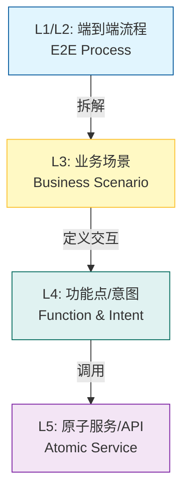
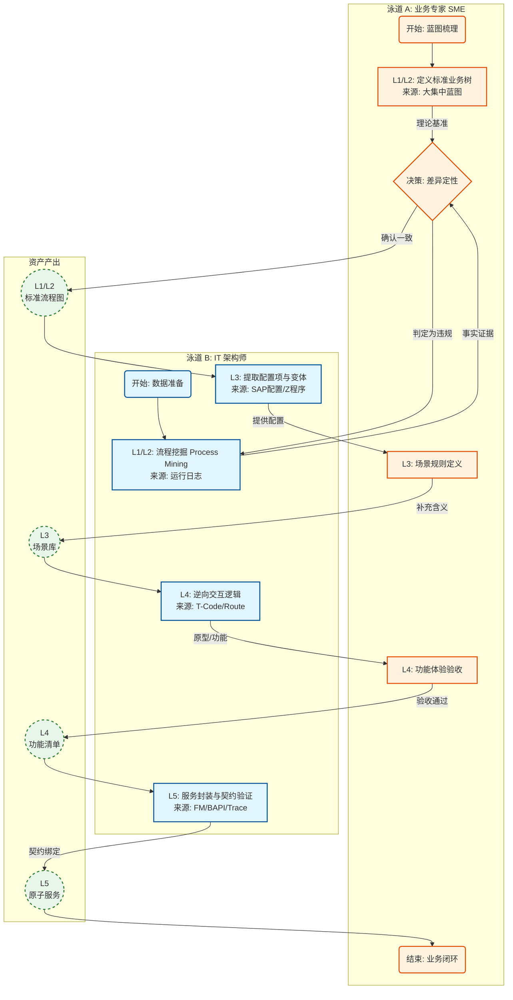
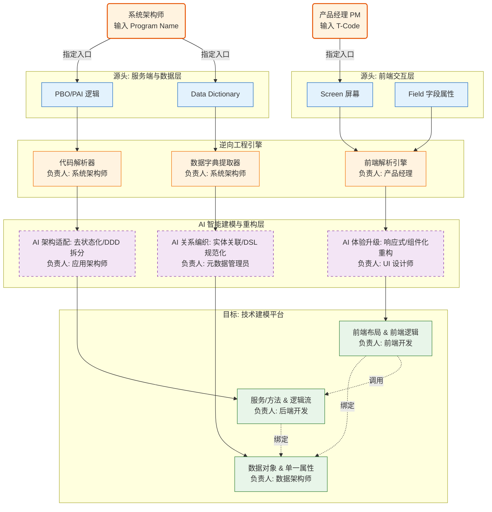

# 现代化 ERP 设计方法论：基于“双V校验”的高质量架构重构

## 1. 核心理念 (Core Philosophy)

在新型 ERP 的设计中，针对**“质量优先，准确率至上”**的要求，我们摒弃单纯的“逆向猜测”模式，采用 **“正向对标定义，逆向数据验证”** 的 **双V校验模型 (Dual-V Validation Model)**。

*   **Design for Quality**：每一层资产的产出，都必须经过“业务蓝图（理论值）”与“系统日志/代码（实际值）”的双重交叉验证。
*   **Zero Assumption**：不假设任何代码逻辑是多余的，也不假设任何蓝图流程被完美执行。**一切差异（Gap）皆需专家定性。**

## 2. 四层架构映射模型 (The 4-Layer Mapping Model)

我们采用 L1 到 L5 的层级拆解法，确保每一行代码都能追溯到业务价值。

### 2.1 L1/L2：端到端流程 (End-to-End Process)
*   **定义**：跨越部门边界的业务价值流（Value Stream）。
*   **示例**：LTC (线索到现金)、PTP (采购到付款)、ITR (问题到解决)。
*   **关注点**：业务闭环、合规性、整体效率。
*   **ERP 视角**：这是系统的骨架，决定了 ERP 的边界。

### 2.2 L3：业务场景 (Business Scenario) —— *核心驱动力*
*   **定义**：流程在特定条件、特定角色下的具体实例。
*   **示例**：
    *   *常规场景*：基于框架协议的标准采购。
    *   *异常场景*：生产线紧急停机导致的加急备件采购。
*   **价值**：**这是智能编排的工作单元**。系统不是在跑“流程”，而是在处理“场景”。我们需要为每个场景定义 Rulebook（规则书），教系统如何在该场景下决策。

### 2.3 L4：功能点/意图 (Function / User Intent)
*   **定义**：用户（人或系统）为完成场景而执行的具体动作。
*   **演变**：
    *   *传统 ERP*：菜单、按钮、表单（GUI）。
    *   *现代化 ERP*：除了 GUI，更多表现为 **意图（Intent）**。例如用户输入“帮我买个电机”，系统识别出“创建采购申请”这一功能点。
*   **关注点**：用户体验（UX）、交互逻辑。

### 2.4 L5：原子服务 (Atomic Service / Capability)
*   **定义**：可独立部署、可复用的技术实现单元（API/微服务）。
*   **原则**：遵循 **领域驱动设计 (DDD)**，确保服务是“高内聚”的。
*   **关键要求**：
    *   **标准化**：输入输出必须标准化，以便系统理解。
    *   **可编排 (Composable)**：服务之间解耦，系统可以根据新场景像搭积木一样调用不同服务。

---

## 3. 高精度重构策略：双V校验模型 (Dual-V Validation)

为了确保 L1-L5 的资产**准确率最高**，我们调整工作流，采用**“标准先行，证据辅佐，专家终审”**的严谨模式。

### 3.1 质量优先的作业流程

每一层级必须通过以下 **“三位一体”** 的校验，方可入库：

1.  **理论基准 (Baseline)**：来自 SAP 标准/大集中蓝图。
2.  **事实证据 (Evidence)**：来自系统日志/代码逆向。
3.  **差异定性 (Verdict)**：**专家对“基准”与“证据”不一致的地方进行 100% 的逐条判决。**

### 3.2 L1-L5 高精度作业流程图 (Swimlane Process)

本流程图展示了 **业务专家 (SME)** 与 **IT 架构师** 在各层级如何通过“双V校验”确保资产质量。

### 3.3 各层级高精度提取方案与人机分工

#### L1/L2 流程：专家定义标准，工具挖掘事实
*   **核心策略**：以“蓝图”为王，以“日志”查漏。先画出大集中蓝图定义的“标准树”，再把挖掘出的日志往树上挂。
*   **【执行主体与工具】**：
    *   **人 (Roles)**：
        *   **【主要负责人】业务流程总监 (Process Owner)**：对流程的合规性、完整性负最终责任。拥有对“违规路径”的一票否决权。
        *   **协助者**：流程挖掘分析师 (清洗数据)、关键用户 (确认变体)。
    *   **工具 (Process Mining)**：**Celonis / 开源算法**。输入 ERP 运行日志，输出真实的流程有向图和频率统计。
    *   **AI (RAG)**：**辅助者**。检索历史蓝图文档，回答“标准流程是什么”的问题。

#### L3 场景：以单据为核心，聚类碎片规则
*   **痛点**：SAP 场景逻辑分散在配置、代码和主数据中，直接提取极为琐碎。
*   **核心策略**：**“一根三叶”聚类法**。以**业务单据 (Document)** 为引力中心，将分散的规则吸附并聚类成完整场景。
    1.  **根 (Root)**：以 **单据类型 (Order Type)** 为主索引（如 NB, ZUB）。这是场景的第一级分类。
    2.  **叶 1 (Item)**：结合 **行项目类别 (Item Category)** 细分（如 标准行 vs 寄售行）。
    3.  **叶 2 (Code)**：吸附挂载在该单据保存/校验链条上的 **Z 代码/增强**。
    4.  **叶 3 (Data)**：关联触发该流程的关键 **主数据属性**（如批次管理标识）。
*   **【执行主体与工具】**：
    *   **人 (Roles)**：
        *   **【主要负责人】资深功能顾问 (Senior Consultant)**：对“场景-配置”的映射准确性负责。决定哪些聚类是有效业务场景，哪些是无效垃圾数据。
        *   **协助者**：ABAP 开发专家 (定位增强点)。
    *   **工具 (Scene Clustering)**：**关联分析脚本**。
        *   输入：单据类型列表。
        *   输出：`场景 = 单据类型 + 关键行项目 + 必经增强逻辑` 的结构化描述。
    *   **AI (LLM)**：**规则摘要**。
        *   阅读“叶 2”中的增强代码，总结为一句人话规则：“此场景要求在保存前必须校验预算”。

#### L4 功能：T-Code 源码深度解析，AI 辅助补全
*   **核心策略**：以 T-Code 为入口，静态解析 ABAP Screen 逻辑。
*   **【执行主体与工具】**：
    *   **人 (Roles)**：
        *   **【主要负责人】产品经理 (Product Manager)**：对功能的用户体验 (UX) 和业务可用性负责。决定逆向出的功能是否需要重构优化。
        *   **协助者**：UI 设计师 (界面审核)、业务分析师 (BA)。
    *   **工具 (ABAP Parser)**：**自定义源码分析器**。
        1.  **入口定位**：基于 T-Code 下载对应的 ABAP 主程序。
        2.  **元数据提取**：解析 Screen Painter (SE51) 定义，提取屏幕编号、控件类型、字段属性（必填/只读/隐藏）。
        3.  **逻辑剥离**：识别 PAI (Process After Input) 模块中的用户交互校验逻辑。
    *   **AI (Copilot)**：**信息补全**。对于静态代码无法解析的动态 UI 属性（如基于配置表动态隐藏字段），利用 AI 读取相关代码段进行推断和补全。

#### L5 服务：PBO/PAI 调用链分析，后端逻辑沉淀
*   **核心策略**：通过 PBO/PAI 切分前后端，利用调用链识别服务边界。
*   **【执行主体与工具】**：
    *   **人 (Roles)**：
        *   **【主要负责人】系统架构师 (System Architect)**：对 API 的粒度、复用性、技术契约 (Contract) 负责。确保服务符合领域驱动设计 (DDD)。
        *   **协助者**：后端开发工程师 (封装实现)。
    *   **工具 (Call Graph Analyzer)**：**静态 + 动态分析**。
        1.  **逻辑切分**：以 PBO/PAI 为界，PBO 通常对应数据查询服务 (GET)，PAI 对应业务处理服务 (POST/PUT)。
        2.  **调用链追踪**：分析程序内部的 `CALL FUNCTION` / `CALL METHOD` 链路，识别出核心的后端业务逻辑（去除纯 UI 控制代码）。
    *   **AI (Code Assistant)**：**服务封装**。
        1.  阅读提取出的后端逻辑代码，自动生成服务描述和接口文档。
        2.  识别并重构“面条代码”，建议拆分为原子服务。

### 3.4 专家介入边界与协作模型 (SME Responsibility)

业务专家（SME）不是全程陪跑，而是**“把控上层，确认中层，放权下层”**。

| 层级 | 业务专家 (SME) 职责 | IT/架构师职责 | 协作模式 |
| :--- | :--- | :--- | :--- |
| **L1/L2 流程** | **主导者 (Owner)** 定义业务价值流，确认流程的合规性。 | **辅助者** 提供挖掘出的流程图供专家确认。 | 专家根据蓝图“指路”，IT 提供日志“验路”。 |
| **L3 场景** | **核心定义者** 解释“为什么会有这个分支”。定义场景的规则（Rulebook）。 | **数字化翻译** 将专家的口语描述转化为结构化的场景模型。 | **强协作区**：专家讲故事，IT 记模型。 |
| **L4 功能** | **验收者 (Reviewer)** 确认功能是否满足场景需求，界面是否友好。 | **主导者** 设计交互逻辑、UI/UX、前端路由。 | 专家做 UAT 测试。 |
| **L5 服务** | **无 (None)** 不需要关注 API 细节。 | **主导者** 设计接口契约、数据库模型、代码实现。 | 黑盒交付。 |

---

## 4. L4/L5 逆向到建模平台的落地流水线 (Implementation Pipeline)

为了将逆向成果直接转化为**技术建模平台**中的可执行资产，我们设计了 **“逆向提取 $\rightarrow$ AI 增强 $\rightarrow$ 模型注入”** 的自动化流水线。

### 4.1 核心流程架构图

### 4.2 详细落地步骤与平台元模型映射

我们将 SAP 逆向资产精准映射到技术建模平台的六大核心对象：

| 逆向资产源 (SAP) | 平台对象 (Target Model) | 映射与转化逻辑 |
| :--- | :--- | :--- |
| **SE11 Data Element** | **单一属性 (Property)** | 提取长度、类型、标签。AI 负责语义化命名 (MATNR $\rightarrow$ materialId)。 |
| **SE11 Table/Structure**| **数据对象 (Entity)** | 将表结构转换为实体模型，字段关联对应的“单一属性”。 |
| **SE51 Screen Layout** | **前端布局 (Layout)** | 解析屏幕坐标，AI 将其重构为 Flex/Grid 响应式布局。 |
| **PAI UI Control** | **前端逻辑 (Logic)** | 提取简单的 UI 交互（如“选择A则隐藏B”），转换为前端低代码逻辑。 |
| **FM / User Command** | **服务/方法 (Service)** | 一个 PAI 事件对应一个服务方法。AI 生成 OpenAPI 定义。 |
| **ABAP Code Block** | **逻辑流 (Flow)** | 将后端业务代码转换为可视化逻辑流或伪代码，供开发者二次开发。 |

### 4.3 AI 智能建模层的三大核心职责与责任人 (The AI Value-Add & Ownership)

AI 在这一层不仅是“翻译”，更是**重构**。它必须确保产出的模型满足 **DSL 规范、未来架构、未来体验** 三重标准。为此，每一项 AI 作业都需配备人类专家进行审核。

#### 1. 关系编织 (Relation Design for DSL)
*   **目标**：满足技术建模平台的 DSL 完整性要求。
*   **【责任人】平台元数据管理员 (Metadata Admin)**：审核 AI 建立的绑定关系是否准确，防止“张冠李戴”。
*   **AI 动作**：
    *   **自动绑定**：AI 识别出前端控件 `Input_Material` 和后端表字段 `MARA-MATNR` 是同一个东西，自动在 DSL 中建立 `Binding Path`。
    *   **依赖注入**：确保生成的服务 DSL 正确引用了数据对象 DSL，不出现悬空引用 (Dangling References)。

#### 2. 架构适配 (Architecture Alignment)
*   **目标**：满足未来云原生/微服务架构要求。
*   **【责任人】应用架构师 (App Architect)**：审核 AI 拆分的服务边界是否合理，防止“微服务碎片化”。
*   **AI 动作**：
    *   **去状态化**：识别 SAP 中的全局变量 (Global Variables) 依赖，重构为通过 API 参数传递的无状态逻辑。
    *   **DDD 拆分**：如果一个 SAP 程序包含 50 个 Function，AI 根据语义将其拆分为 3 个独立的领域服务（如 订单服务、库存服务、支付服务）。

#### 3. 体验升级 (UX Modernization)
*   **目标**：满足未来的用户体验要求 (Fiori / Ant Design)。
*   **【责任人】高级 UI 设计师 (Lead UI Designer)**：审核 AI 重构的页面布局是否美观、易用，符合企业设计规范。
*   **AI 动作**：
    *   **组件升维**：将 SAP 的“文本框+F4搜索”自动重构为现代的“Select/Combobox”组件。
    *   **响应式重排**：将 SAP 的绝对坐标布局 (Absolute Layout) 转换为 Flex/Grid 响应式布局，以适配移动端。

#### 阶段一：服务端与字典建模 (架构师主导)
*   **触发**：系统架构师输入 **Program Name** (如 `SAPLMEPO`)。
*   **任务**：基于程序的深度解析，构建地基。
*   **操作**：
    1.  **数据层**：系统扫描主程序引用的 Tables 和 Structure，逆向生成平台的 **“数据对象”** 和 **“单一属性”**。
    2.  **服务层**：系统解析主程序中的 Form/Function，提取为平台的 **“服务”** 和 **“方法”**。AI 辅助生成 **“逻辑流”** 描述。

#### 阶段二：前端萃取与建模 (产品经理主导)
*   **触发**：产品经理输入 **T-Code** (如 `ME21N`)。
*   **任务**：基于屏幕的交互还原，构建表现层。
*   **操作**：
    1.  **萃取**：系统根据 T-Code 读取具体的 Screen 布局和 Field 属性。
    2.  **注入**：将萃取结果映射为平台的 **“前端布局”** 和 **“前端逻辑”**。
    3.  **绑定**：自动将前端控件绑定到阶段一生成的“数据对象”上（*前提：阶段一已完成，否则仅生成孤立页面*）。

### 4.3 平台同步策略
*   **同步顺序**：**单一属性 $\rightarrow$ 数据对象 $\rightarrow$ 服务/方法 $\rightarrow$ 前端布局**。
*   **三角互锁**：前端布局中的控件绑定“数据对象”，服务方法的入参也绑定“数据对象”，实现端到端的一致性。

---

## 5. 实战案例：从 PTP 到 API 的拆解

以 **“生产急件采购”** 为例，展示如何贯穿这四层：

| 层级 | 内容描述 | 系统角色与作用 |
| :--- | :--- | :--- |
| **L1 流程** | **PTP (采购到付款)** | 监控整体流程时效，预警卡顿节点。 |
| **L2 子流程**| 采购申请与审批 | / |
| **L3 场景** | **生产线设备故障，需紧急采购非库配备件** | **场景感知**：系统识别到这是一个“紧急”场景，自动触发“绿色通道”规则（如免除三方比价，优先选用核心供应商）。 |
| **L4 功能** | 1. 识别备件型号 2. 检索供应商库存 3. 创建加急订单 | **交互增强**：用户上传损坏零件照片，视觉识别型号（功能点1），自动填写表单。 |
| **L5 服务** | `GET /inventory/spare-parts` `GET /suppliers/ranking` `POST /purchase-orders/urgent` | **自动执行**：系统自动调用 API 查询库存，若无库存，调用 API 创建订单并标记 `priority=HIGH`。 |

---

## 5. 关键设计原则 (Key Principles)

1.  **服务粒度要适中**：
    *   服务太粗（如一个巨大的单体接口），系统无法灵活拆解使用。
    *   服务太细（如只有增删改查），编排成本过高。
    *   *建议*：以**领域服务 (Domain Service)** 为粒度，如“计算订单总价”、“校验信用额度”。

2.  **元数据驱动 (Metadata Driven)**：
    *   为了让系统理解 L5 的服务，必须有完善的元数据（Metadata）或语义描述（Semantic Layer）。不仅要有 API 文档，还要有“这个服务是干什么的、什么时候用”的语义标注。

3.  **场景库建设**：
    *   不要只画流程图。建立 **场景库 (Scenario Library)**，穷举业务中的长尾场景，这是系统应对复杂业务最宝贵的资产。

---

## 6. 总结

> **“流程是骨架，场景是肌肉，功能是神经末梢，服务是细胞。”**

做现代化 ERP，不能只盯着功能点（页面长什么样），必须：
1.  向上梳理**场景**，喂给系统学习；
2.  向下沉淀**服务**，供系统调用。
