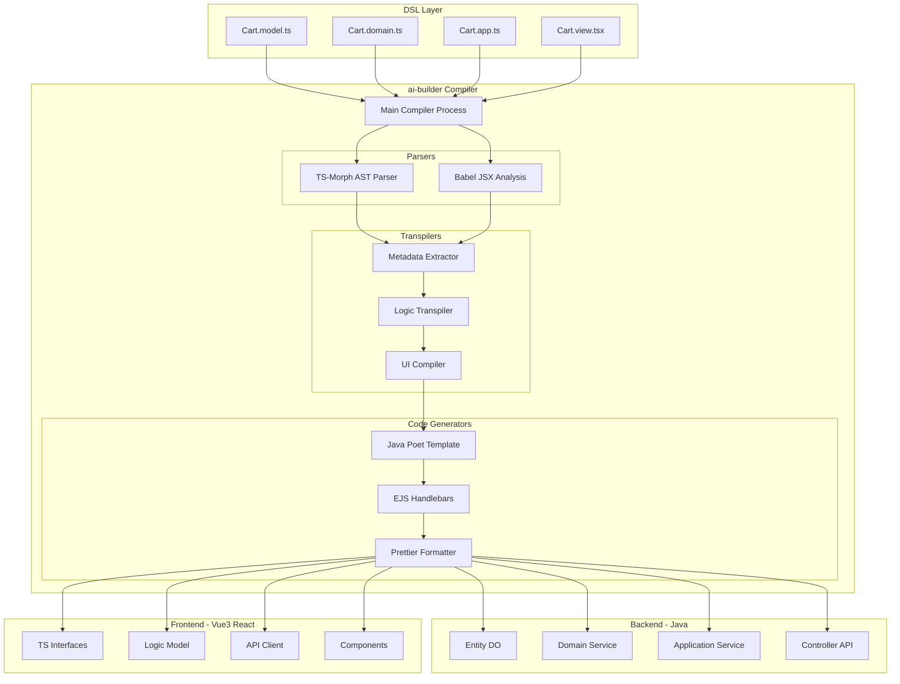

# 基于 TypeScript 的全栈 MDA (模型驱动架构) 设计白皮书

**版本**: 1.6  
**日期**: 2025-11-22  
**核心理念**: Code-First MDA, TypeScript as DSL  
**项目名称**: ai-builder

---

## 1. 愿景与核心目标

我们旨在构建一套名为 **ai-builder** 的基于 **TypeScript (TS)** 的统一领域特定语言 (DSL) 体系。

通过借用 TypeScript 强大的类型系统和 VS Code 原生的 LSP (语言服务协议) 能力，让开发者在**不安装任何 IDE 插件**的情况下，以**强类型、高智能提示**的方式编写业务模型和逻辑，并自动编译生成：

*   **后端**: Java (SpringBoot, MyBatis-Plus, DDD 分层架构)
*   **前端**: Vue3 (Element Plus) / React (Ant Design)

### 核心价值
1.  **单一事实来源 (Single Source of Truth)**: 业务逻辑（如价格计算）、数据模型（字段定义）只定义一次，前后端永远保持一致。
2.  **逻辑同源，异构执行**: 领域逻辑写一次，后端编译为 Java 用于核心业务，前端编译为 JS 用于本地快速反馈。
3.  **微服务架构原生支持**: DSL 设计天然支持 DDD 分层（Domain/App/Interface）。

---

## 2. 架构蓝图



---

## 3. DSL 规范设计

我们将定义一个 `@ai-builder/dsl` SDK 包，提供所有用于描述业务的装饰器和基础类型。

### 3.1 数据模型 DSL (`.model.ts`)

这是所有类型的源头，定义数据库实体。

```typescript
import { Entity, Field, DbField, Validation } from '@ai-builder/dsl';

/**
 * 购物车明细
 * @desc 映射为后端 trade_cart_item 表
 */
@Entity({ table: 'trade_cart_item', comment: '购物车明细表' })
export class CartItem {

    @Field({ label: '主键' })
    @DbField({ primaryKey: true, type: 'BIGINT' })
    id: number;

    @Field({ label: '商品名称' })
    @Validation({ required: true, max: 100 })
    spuName: string;

    @Field({ label: '购买数量' })
    @DbField({ default: 1 })
    @Validation({ min: 1 })
    count: number;

    @Field({ label: '单价' })
    @DbField({ type: 'DECIMAL', precision: 10, scale: 2 })
    price: Decimal; 
}
```

### 3.2 类型系统 DSL (Types)

除了实体 (Entity)，我们明确定义了 4 种派生类型，以支持精确的代码生成。开发者可以通过继承、Pick、Omit 等 TS 语法快速定义它们。

#### (1) Command / Req (指令/请求)
用于**增删改**操作的输入参数。
*   **特征**: 包含校验注解 (`@NotNull`)，通常不含 ID 和审计字段。

```typescript
import { Command } from '@ai-builder/dsl';

// 自动派生：从 CartItem 中剔除 id, price (价格由后端算), spuName (后端查)
// 只保留 count, skuId
export class AddCartItemCmd extends Omit(CartItem, ['id', 'price', 'spuName']) {
    @Validation({ required: true })
    skuId: number;
}
```

#### (2) View / Resp (视图/响应)
用于**展示**操作的输出数据。
*   **特征**: 可能包含连表查询的字段，不含敏感字段。

```typescript
import { View } from '@ai-builder/dsl';

export class CartItemResp extends CartItem {
    // 扩展字段：商品图片 (来自连表)
    @Field({ label: '商品图片' })
    skuImage: string;
}
```

#### (3) Query / Filter (查询/过滤)
用于**搜索**操作的过滤条件。
*   **特征**: 字段全是可选的，包含分页参数。

```typescript
import { Query, PageParam } from '@ai-builder/dsl';

export class CartListQuery extends PageParam {
    @Field({ label: '商品名模糊查询' })
    spuNameLike?: string;
}
```

#### (4) Event / Msg (事件/消息)
用于**异步解耦**的消息体。

```typescript
import { Event } from '@ai-builder/dsl';

@Event({ topic: 'trade.cart.add' })
export class CartItemAddedEvent {
    userId: number;
    skuId: number;
    addTime: Date;
}
```

---

### 3.3 领域逻辑 DSL (`.domain.ts`)

关注 **核心业务规则、状态变更、原子计算**。我们采用 **"数据与行为分离"** 的模式（类似 Rust 的 Struct + Impl），以适应 DSL 的跨语言生成特性。

*   **数据 (State)**: 由 `.model.ts` 中的 `@Entity` 定义。
*   **行为 (Behavior)**: 由 `.domain.ts` 中的 `@DomainLogic` 定义。

> **⚠️ 核心约束 (Strict Isolation)**
> 为了确保逻辑能无缝在前端运行，`DomainLogic` 必须保持 **"纯净 (Pure)"**：
> *   **禁止 IO**: 严禁调用 Repository/Mapper 进行数据库读写。
> *   **禁止 RPC**: 严禁调用 Feign/Http 请求外部服务。
> *   **数据来源**: 所有计算所需的数据，必须通过 **方法参数** (通常是 Entity 或 Cmd) 传入。

```typescript
import { DomainLogic, Action, Rule } from '@ai-builder/dsl';
import { CartItem } from './Cart.model'; // ✅ 引用 Entity 作为类型契约

@DomainLogic
export class CartDomainLogic {

    /**
     * 计算总价 (纯内存计算)
     * 入参: items 是 Entity 数组。
     * 在运行时，它只是符合 CartItem 结构的 JSON 对象。
     */
    @Action
    public static calculateTotal(items: CartItem[]): Decimal {
        let total = new Decimal(0);
        for (const item of items) {
            total = total.add(item.price.mul(item.count));
        }
        return total;
    }

    /**
     * 库存检查 (纯逻辑校验)
     * ✅ 正确：不查库，直接校验传入的数值
     */
    @Rule
    public static checkStock(buyCount: number, stock: number): void {
        if (buyCount > stock) {
            throw new Error("库存不足");
        }
    }
    
    /**
     * ❌ 错误示例
     */
    // @Action
    // async invalidAction(id: number) {
    //     const item = await Repo.findById(id); // 禁止！前端无法执行查库
    //     item.count++;
    //     await Repo.save(item); // 禁止！持久化是 AppService 的职责
    // }
}
```

### 3.4 应用服务 DSL (`.app.ts`)

关注 **用例编排、事务控制、跨域调用**。
**注意**: `.app.ts` 中的逻辑**不能**在前端复用运行，因为它依赖数据库和事务。它在前端会被编译为 **API Client (Ajax)**。

```typescript
import { AppService, Inject, Action, Expose } from '@ai-builder/dsl';
import { AddCartItemCmd, CartItemResp } from './Cart.model'; // 引用定义的类型

@AppService
export class CartAppService {

    @Inject domain: CartDomainLogic;

    /**
     * 添加商品流程
     * 入参: AddCartItemCmd (自动生成 @RequestBody)
     * 出参: boolean
     * 
     * 前端编译结果: CartApi.addItem(cmd) -> axios.post('/cart/add', cmd)
     */
    @Action({ transaction: true })
    @Expose(method: 'POST', path: '/cart/add')
    async addItem(cmd: AddCartItemCmd): Promise<boolean> {
        // ...
        return true;
    }
}
```

### 3.5 核心 DSL 标准库详解 (`@ai-builder/dsl`)

此包是 ai-builder 的基石，提供了定义业务模型、逻辑和服务的所有装饰器与基类。它是**全栈共享**的（在前端仅作为类型引用，在后端作为运行时注解）。

#### (1) 模型与关系 (Schema & Relations)
用于 `.model.ts` 文件，描述数据结构与持久化元数据。

| 装饰器/类 | 用途 | 参数示例 |
| :--- | :--- | :--- |
| **`@Entity`** | 定义数据库实体/聚合根 | `{ table: 'sys_user', comment: '用户' }` |
| **`@Field`** | 定义通用字段属性 | `{ label: '姓名', nullable: false }` |
| **`@DbField`** | 定义数据库物理属性 | `{ type: 'TEXT', index: true, unique: true }` |
| **`@Validation`** | 定义校验规则 (JSR303) | `{ min: 0, max: 100, email: true, regex: '...' }` |
| **`@Composition`** | **组合关系** (父子) | `{ cascade: ['ALL'], fetch: 'EAGER' }` <br> *级联保存、删除，生命周期绑定* |
| **`@Association`** | **关联关系** (引用) | `{ to: () => User, on: (u) => u.id }` <br> *仅引用 ID，无级联操作* |

#### (2) 逻辑与服务 (Logic & Services)
用于 `.domain.ts` 和 `.app.ts` 文件，描述业务行为。

| 装饰器/类 | 用途 | 参数示例 |
| :--- | :--- | :--- |
| **`@DomainLogic`** | 纯领域逻辑类标记 | - |
| **`@AppService`** | 应用服务类标记 | - |
| **`@Action`** | 业务方法标记 | `{ transaction: true, log: '操作日志' }` |
| **`@Rule`** | 校验规则方法标记 | - |
| **`@Expose`** | API 暴露配置 | `{ method: 'POST', path: '/submit', auth: true }` |
| **`@Inject`** | 依赖注入 | - |

#### (3) 基础类型系统 (Type System)
提供 DTO 基类，用于快速派生数据传输对象。

*   **`Command`**: 写操作入参基类（自动剔除审计字段）。
*   **`Query` / `PageParam`**: 查询参数基类（含 `pageNo`, `pageSize`）。
*   **`View`**: 读操作出参基类。
*   **`Event`**: 领域事件基类。

#### (4) 运行时原语 (Runtime Primitives)
为了支持**同构逻辑 (Isomorphic Logic)**，我们在 SDK 中内置了以下工具类的 Polyfill。

*   **`Decimal`**: 高精度计算类。
    *   *后端编译*: `BigDecimal`
    *   *前端编译*: `decimal.js`
    *   *示例*: `price.mul(count).add(fee)`
*   **`Repo<T>`**: 静态仓储访问器 (仅限 `@AppService` 使用)。
    *   *方法*: `findById(id)`, `save(entity)`, `delete(id)`, `findOne({ where: ... })`
*   **`EventBus`**: 事件总线。
    *   *方法*: `emit(event)`, `on(topic, handler)`

### 3.6 界面视图 DSL (`.view.tsx`) - 函数式组件 (Functional Style)

为了紧跟现代前端技术栈（React Hooks / Vue 3 Composition API）的潮流，并提供更好的类型推导与逻辑复用能力，我们采用 **函数式组件** 风格定义视图。

相比于 Class 风格，函数式写法更轻量，且能天然通过 **Custom Hooks** 实现跨组件的逻辑复用。

```tsx
import { definePage, useState, useComputed, useEffect } from '@ai-builder/dsl/ui';
import { Page, Table, Button, Tag, Message } from '@ai-builder/dsl/std-ui';
import { CartDomainLogic } from './Cart.domain'; 
import { CartAppService } from './Cart.app';

/**
 * 购物车页面
 * 编译目标: 
 * - Vue3: defineComponent({ setup() { ... } })
 * - React: function CartPage() { ... }
 */
export default definePage({ 
    route: '/trade/cart',
    title: '购物车',
    // 权限与菜单配置
    permission: 'trade:cart:view',
    menu: { parent: 'TradeCenter', order: 10 }
}, () => {

    // 1. 响应式状态 (State)
    // 对应 Vue ref() 或 React useState()
    const selectedIds = useState<number[]>([]);
    const items = useState<CartItemResp[]>([]);
    const isLoading = useState(false);

    // 2. 计算属性 (Computed)
    // 自动追踪依赖，对应 Vue computed() 或 React useMemo()
    const totalPrice = useComputed(() => {
        const selectedItems = items.value.filter(i => selectedIds.value.includes(i.id));
        // ✨ 复用 .domain.ts 中的纯逻辑
        return CartDomainLogic.calculateTotal(selectedItems);
    });

    // 3. 副作用与生命周期 (Effect)
    // 对应 Vue onMounted/watch 或 React useEffect
    useEffect(async () => {
        isLoading.value = true;
        try {
            items.value = await CartAppService.getList();
        } finally {
            isLoading.value = false;
        }
    }, []); // 空数组表示仅挂载时执行

    // 4. 事件处理 (Handlers)
    const handleCheckout = async () => {
        if (selectedIds.value.length === 0) {
             return Message.warning('请选择商品');
        }
        await CartAppService.submit(selectedIds.value);
        Message.success('下单成功');
    };

    // 5. 视图渲染 (Render)
    // 返回 TSX 结构
    return () => (
        <Page loading={isLoading.value}>
            <Table data={items.value} selection={selectedIds}>
                <Table.Column prop="spuName" label="商品名称" />
                <Table.Column label="单价">
                    {(row) => `¥${row.price}`} 
                </Table.Column>
                <Table.Column label="库存状态">
                    {/* 复用 Domain 逻辑判断 UI 展示 */}
                    {(row) => CartDomainLogic.isStockLow(row) ? <Tag color="red">紧张</Tag> : null}
                </Table.Column>
            </Table>
            
            <div class="footer">
                <span>合计: ¥{totalPrice.value}</span>
                <Button onClick={handleCheckout} type="primary">立即支付</Button>
            </div>
        </Page>
    );
});
```

### 3.7 前端 DSL 标准库详解

我们将前端 DSL 拆分为两个核心包，以实现**逻辑与视觉的彻底解耦**。

#### (1) 逻辑原语层 (`@ai-builder/dsl/ui`)
提供跨框架的响应式能力与生命周期抽象，抹平 Vue/React 的差异。

*   **核心定义**:
    *   `definePage(meta, setup)`: 定义页面入口。
    *   `defineComponent(props, setup)`: 定义可复用组件。
*   **响应式系统**:
    *   `useState<T>(init)`: 定义状态 (ref/useState)。
    *   `useComputed<T>(fn)`: 定义计算属性 (computed/useMemo)。
    *   `useWatch(source, cb)`: 监听状态变化。
*   **生命周期**:
    *   `useEffect(fn, deps)`: 副作用钩子。
    *   `onMounted(fn)`: 挂载钩子。
*   **路由能力**:
    *   `useRouter()`: 路由跳转。
    *   `useParams()`: 获取 URL 参数。

#### (2) 视觉组件协议层 (`@ai-builder/dsl/std-ui`)
提供一套**“虚组件”**标准协议。开发者编写代码时引用此包，编译器在构建时根据配置将其**替换**为具体的 UI 库实现（如 Element Plus 或 Ant Design）。

| 组件分类 | 包含组件 (Standard Components) | 编译目标 (Element Plus) | 编译目标 (Ant Design) |
| :--- | :--- | :--- | :--- |
| **布局** | `Page`, `Card`, `Row`, `Col` | `<el-card>`, `<el-row>` | `<Card>`, `<Row>` |
| **表单** | `Form`, `Input`, `Select`, `Date` | `<el-input>`, `<el-select>` | `<Input>`, `<Select>` |
| **展示** | `Table`, `Tag`, `Descriptions` | `<el-table>`, `<el-tag>` | `<Table>`, `<Tag>` |
| **交互** | `Button`, `Modal`, `Message` | `<el-button>`, `ElMessage` | `<Button>`, `message` |

### 3.8 为什么选择函数式风格？

| 特性 | Class Component (旧) | Functional Component (新) | 优势 |
| :--- | :--- | :--- | :--- |
| **代码结构** | 属性/方法分离，`this` 指向复杂。 | 逻辑内聚，无 `this` 困扰。 | **代码量减少 30%**，逻辑更清晰。 |
| **逻辑复用** | 需要用 Mixin 或 HOC，类型推导困难。 | **Hooks (组合式函数)**，天然支持。 | 轻松提取 `useCartLogic()` 供多处复用。 |
| **编译难度** | 需解析装饰器，处理继承树。 | 直接映射到 Vue `setup()` / React `Hook`。 | **编译实现极简**，生成的代码更接近手写。 |
| **类型安全** | 依赖复杂的装饰器类型定义。 | TS 原生函数类型推导。 | 智能提示更精准。 |

这一调整使得前端 DSL 更加现代化，对于习惯 Vue 3 或 React 的开发者来说几乎没有学习成本。

### 3.9 安全与系统基础 DSL (Security & Infra)

ERP 系统必须具备完善的权限控制。我们不单独开发一个“权限模块 DSL”，而是将其分散在各个业务 DSL 中，由编译器自动聚合。

#### (1) 权限控制 (@Permission)
在 `.app.ts` 中，通过注解声明接口所需的权限。

```typescript
import { Permission } from '@ai-builder/dsl/security';

@AppService
export class CartAppService {

    // 编译为: @PreAuthorize("@ss.hasPermission('trade:cart:add')")
    @Action
    @Permission('trade:cart:add') 
    @Expose(method: 'POST', path: '/cart/add')
    async addItem(cmd: AddCartItemCmd) {
        // ...
    }
}
```

#### (2) 菜单定义 (@Menu)
我们采用 **"默认声明 + 集中引用"** 的策略，兼顾开发效率与灵活性。

*   **模式 A: 组件内默认定义 (90% 场景)**
    适合绝大多数“一个页面对应一个菜单”的情况。开发时顺手写上，编译器自动生成菜单。
    ```typescript
    @Component({ 
        route: '/trade/cart', // 定义路由 (Route)
        title: '购物车',
        menu: { parent: 'TradeCenter' } // 定义默认菜单位置 (可选)
    })
    export class CartPage { ... }
    ```

*   **模式 B: 集中配置复用 (10% 场景)**
    适合“一个组件被多个菜单复用”或“调整菜单结构”的场景。在 `app.menu.ts` 中显式定义。
    ```typescript
    // app.menu.ts
    export const ExtraMenus = [
        // 场景：同一个 CartPage 组件，在"促销部"菜单下也出现，且标题不同
        { 
            name: '促销购物车检查', 
            parent: 'PromotionDept',
            link: '/trade/cart?mode=check' // 指向已有的组件路由
        }
    ];
    ```
    **编译逻辑**: 编译器会合并 `组件注解中的菜单` + `app.menu.ts 中的菜单`，生成最终的 SQL。

#### (3) 用户上下文 (UserContext)
在 `.domain.ts` 逻辑中，经常需要获取“当前用户”。我们提供标准库支持。

```typescript
import { SecurityContext } from '@ai-builder/dsl/security';

@DomainService
export class CartDomainLogic {
    @Action
    createCart() {
        // 编译为: SecurityFrameworkUtils.getLoginUserId()
        const userId = SecurityContext.getUserId();
        
        // 编译为: SecurityFrameworkUtils.getLoginUserRole()
        if (SecurityContext.hasRole('admin')) {
            // ...
        }
    }
}
```

#### (4) 路由权限 (@Component Permission)
路由的访问权限通常与菜单显隐权限一致。我们直接在 UI 组件中声明。

```typescript
@Component({ 
    route: '/trade/cart',
    title: '购物车',
    // 声明：只有拥有 'trade:cart:list' 权限的用户才能访问此路由
    // 且只有拥有此权限，菜单才会显示
    permission: 'trade:cart:list'
})
export class CartPage { ... }
```
**编译行为**:
1.  **前端路由**: 生成 `vue-router` 配置时写入 `meta: { permission: '...' }`，配合全局路由守卫实现拦截。
2.  **后端菜单**: 生成 SQL 时写入 `sys_menu` 表的 `permission` 字段，实现后端菜单过滤。

### 3.10 多语言能力 DSL (Internationalization / i18n)

为了对标 SAP S/4HANA 的全球化能力，我们从 **UI 界面** 和 **业务数据** 两个维度提供原生 DSL 支持。

#### (1) UI 界面多语言 (Static Key-Based)
采用 **远程动态词条 (Remote Translation)** 模式。DSL 中只定义 Key，文案由运行时拉取，支持 SaaS 租户级文案覆盖。

```typescript
// Cart.model.ts
@Field({ 
    // 语法: $t:命名空间.Key
    // 编译器会自动收集这些 Key，生成初始 SQL 插入 sys_i18n_text 表
    label: '$t:trade.cart.spu_name' 
})
spuName: string;
```

#### (2) 业务数据多语言 (Dynamic Data Translation)
采用 SAP 标准的 **扩展文本表模式 (Translation Table Pattern)**。通过 DSL 优雅隐藏复杂的连表逻辑。

```typescript
// Product.model.ts
@Entity
export class Product {
    // 普通字段 (存主表 product)
    @Field()
    price: Decimal;

    // 多语言字段 (存副表 product_lang)
    // 开发者只需标记 i18n: true
    @Field({ i18n: true }) 
    name: string;

    @Field({ i18n: true, type: 'text' })
    description: string;
}
```

**编译行为 (Compiler Magic)**:
1.  **Schema**: 自动创建 `product_lang` 表 (`ref_id`, `locale`, `name`, `description`)。
2.  **Read**: `Repo(Product).findById(1)` -> 自动生成 `LEFT JOIN product_lang ON ... AND locale = current_lang`，并包含 Fallback 逻辑。
3.  **Write**: `Repo(Product).save(dto)` -> 自动拆分数据，分别更新主表和副表。

### 3.11 编译器插件体系 (Compiler Plugins)

为了保持核心 DSL 的纯净与轻量，我们将 **多租户**、**软删除**、**审计** 等非通用或策略多变的能力，抽象为 **编译器插件**。

这使得一套 DSL 可以通过更换插件配置，适配不同的部署环境（如公有云 SaaS vs 私有化单机）。

#### (1) 插件编译流水线 (Compiler Pipeline with Hooks)

插件在编译过程中有多个介入点（Hook Points），严格对应 DSL 的 4 种文件类型：

```text
┌─────────────────────────────────────────────────────────────────────────┐
│                    ai-builder Compiler Pipeline                          │
│                    (严格对应 DSL 文件类型)                               │
├─────────────────────────────────────────────────────────────────────────┤
│                                                                         │
│  ======================== 初始化 ========================                │
│  onInit                  → 插件初始化                                    │
│                                                                         │
│  ======================== .model.ts 处理 ========================       │
│  onModelParse            → 解析后，修改字段/关系定义                      │
│  onModelBackend          → 生成 Java DO / VO                            │
│  onModelFrontend         → 生成 TS Interface                            │
│                                                                         │
│  ======================== .domain.ts 处理 ========================      │
│  onDomainParse           → 解析后，修改逻辑 AST                          │
│  onDomainBackend         → 生成 Java DomainService                      │
│  onDomainFrontend        → 生成 JS LogicModel (同构复用)                 │
│                                                                         │
│  ======================== .app.ts 处理 ========================         │
│  onAppParse              → 解析后，修改服务 AST                          │
│  onAppBackend            → 生成 Java AppService + Controller            │
│  onAppFrontend           → 生成 TS ApiClient (Axios)                    │
│                                                                         │
│  ======================== .view.tsx 处理 ========================       │
│  onViewParse             → 解析后，修改组件 AST                          │
│  onViewGenerate          → 生成 Vue SFC / React Component               │
│                                                                         │
│  ======================== 路由与菜单 ========================            │
│  onRoute                 → 路由配置生成                                  │
│  onMenu                  → 菜单 SQL 生成                                 │
│                                                                         │
│  ======================== 资源与产物 ========================            │
│  onAsset                 → 静态资源处理                                  │
│  onSQL                   → DDL/DML 脚本生成                              │
│                                                                         │
│  ======================== 完成 ========================                  │
│  onFinish                → 编译完成                                      │
│                                                                         │
└─────────────────────────────────────────────────────────────────────────┘
```

#### (2) 插件接口定义 (Plugin Interface)

```typescript
// @ai-builder/core/plugin.ts

export interface CompilerPlugin {
    name: string;
    version: string;

    // ============ 初始化 ============
    onInit?(config: PluginConfig): void;

    // ============ .model.ts 处理 ============
    onModelParse?(entities: EntityMetadata[]): void;
    onModelBackend?(generator: ModelBackendGenerator): void;
    onModelFrontend?(generator: ModelFrontendGenerator): void;

    // ============ .domain.ts 处理 ============
    onDomainParse?(logics: DomainLogicMetadata[]): void;
    onDomainBackend?(generator: DomainBackendGenerator): void;
    onDomainFrontend?(generator: DomainFrontendGenerator): void;

    // ============ .app.ts 处理 ============
    onAppParse?(services: AppServiceMetadata[]): void;
    onAppBackend?(generator: AppBackendGenerator): void;
    onAppFrontend?(generator: AppFrontendGenerator): void;

    // ============ .view.tsx 处理 ============
    onViewParse?(views: ViewMetadata[]): void;
    onViewGenerate?(generator: ViewGenerator): void;

    // ============ 路由与菜单 ============
    onRoute?(routes: RouteMetadata[]): void;
    onMenu?(menus: MenuMetadata[]): void;

    // ============ 资源与产物 ============
    onAsset?(assets: AssetRegistry): void;
    onSQL?(generator: SQLGenerator): void;

    // ============ 完成 ============
    onFinish?(report: CompileReport): void;
}
```

#### (3) 插件工程结构 (Plugin Project Structure)

插件是一个**独立的 NPM 包工程**，拥有标准化的目录结构：

```text
@ai-builder/plugin-multitenancy/          # 插件 NPM 包名
├── package.json                          # 包定义
├── tsconfig.json                         # TS 配置
├── README.md                             # 插件文档
│
├── /src
│   ├── index.ts                          # 插件入口 (导出 Plugin 实例)
│   ├── plugin.ts                         # 插件核心逻辑
│   ├── config.ts                         # 插件配置类型定义
│   │
│   ├── /hooks                            # 各阶段钩子实现
│   │   ├── onModelParse.ts               # .model.ts 解析钩子
│   │   ├── onModelBackend.ts             # 后端 DO/VO 生成钩子
│   │   ├── onModelFrontend.ts            # 前端 Interface 生成钩子
│   │   ├── onAppParse.ts                 # .app.ts 解析钩子
│   │   ├── onAppBackend.ts               # 后端 Service 生成钩子
│   │   ├── onSQL.ts                      # SQL 生成钩子
│   │   └── index.ts                      # 钩子统一导出
│   │
│   ├── /templates                        # 代码生成模板 (可选)
│   │   ├── TenantFilter.java.ejs         # Java 代码模板
│   │   └── TenantContext.ts.ejs          # TS 代码模板
│   │
│   └── /utils                            # 工具函数
│       └── ast-helpers.ts
│
├── /test                                 # 测试用例
│   ├── plugin.test.ts                    # 插件单元测试
│   └── /fixtures                         # 测试 DSL 文件
│       ├── User.model.ts
│       └── User.app.ts
│
└── /dist                                 # 编译产物 (Git Ignored)
    ├── index.js
    ├── index.d.ts
    └── ...
```

#### (4) 插件 package.json 规范

```json
{
  "name": "@ai-builder/plugin-multitenancy",
  "version": "1.0.0",
  "description": "ai-builder 多租户插件 - 自动注入租户隔离能力",
  "main": "dist/index.js",
  "types": "dist/index.d.ts",
  
  "keywords": ["ai-builder", "plugin", "multitenancy", "saas"],
  
  "peerDependencies": {
    "@ai-builder/core": "^1.0.0"
  },
  
  "devDependencies": {
    "@ai-builder/core": "^1.0.0",
    "@ai-builder/plugin-test-utils": "^1.0.0",
    "typescript": "^5.0.0",
    "vitest": "^1.0.0"
  },
  
  "scripts": {
    "build": "tsc",
    "test": "vitest",
    "prepublishOnly": "npm run build && npm test"
  },
  
  "ai-builder": {
    "pluginType": "compiler",
    "hooks": ["onModelParse", "onAppParse", "onAppBackend", "onSQL"],
    "configSchema": "./dist/config.schema.json"
  }
}
```

#### (5) 插件入口文件示例 (src/index.ts)

```typescript
// src/index.ts
import { definePlugin } from '@ai-builder/core';
import { MultiTenancyConfig, defaultConfig } from './config';
import * as hooks from './hooks';

export { MultiTenancyConfig };

/**
 * 多租户插件
 * 
 * @example
 * // ai-builder.config.ts
 * import { MultiTenancyPlugin } from '@ai-builder/plugin-multitenancy';
 * 
 * export default defineConfig({
 *     plugins: [
 *         MultiTenancyPlugin({ 
 *             strategy: 'COLUMN',
 *             field: 'tenant_id',
 *             exclude: ['sys_config']
 *         })
 *     ]
 * });
 */
export function MultiTenancyPlugin(userConfig?: Partial<MultiTenancyConfig>) {
    const config = { ...defaultConfig, ...userConfig };
    
    return definePlugin({
        name: 'multitenancy',
        version: '1.0.0',
        
        onInit(ctx) {
            ctx.logger.info(`[MultiTenancy] 初始化，策略: ${config.strategy}`);
        },
        
        onModelParse: hooks.onModelParse(config),
        onAppParse: hooks.onAppParse(config),
        onAppBackend: hooks.onAppBackend(config),
        onSQL: hooks.onSQL(config),
    });
}

export default MultiTenancyPlugin;
```

#### (6) 插件配置定义 (src/config.ts)

```typescript
// src/config.ts

export interface MultiTenancyConfig {
    /** 隔离策略 */
    strategy: 'COLUMN' | 'SCHEMA' | 'DATABASE';
    
    /** 租户字段名 */
    field: string;
    
    /** 排除的表 (不加租户字段) */
    exclude?: string[];
    
    /** 租户 ID 获取方式 */
    contextProvider?: string;
}

export const defaultConfig: MultiTenancyConfig = {
    strategy: 'COLUMN',
    field: 'tenant_id',
    exclude: [],
    contextProvider: 'SecurityContext.getTenantId()'
};
```

#### (7) 钩子实现示例 (src/hooks/onModelParse.ts)

```typescript
// src/hooks/onModelParse.ts
import { EntityMetadata, HookHandler } from '@ai-builder/core';
import { MultiTenancyConfig } from '../config';

export function onModelParse(config: MultiTenancyConfig): HookHandler<EntityMetadata[]> {
    return (entities, ctx) => {
        for (const entity of entities) {
            // 跳过排除的表
            if (config.exclude?.includes(entity.tableName)) {
                ctx.logger.debug(`[MultiTenancy] 跳过表: ${entity.tableName}`);
                continue;
            }
            
            // 检查是否已有该字段
            if (entity.hasField(config.field)) {
                ctx.logger.warn(`[MultiTenancy] ${entity.name} 已存在 ${config.field} 字段，跳过`);
                continue;
            }
            
            // 注入租户字段
            entity.addField({
                name: config.field,
                type: 'number',
                dbField: {
                    type: 'BIGINT',
                    nullable: false,
                    index: true
                },
                label: '租户ID',
                internal: true  // 标记为内部字段，不在 VO 中暴露
            });
            
            ctx.logger.info(`[MultiTenancy] 已为 ${entity.name} 注入 ${config.field} 字段`);
        }
        
        return entities;
    };
}
```

#### (8) 插件测试 (test/plugin.test.ts)

```typescript
// test/plugin.test.ts
import { describe, it, expect } from 'vitest';
import { createTestCompiler } from '@ai-builder/plugin-test-utils';
import { MultiTenancyPlugin } from '../src';

describe('MultiTenancyPlugin', () => {
    
    it('应该给 Entity 注入 tenant_id 字段', async () => {
        const compiler = createTestCompiler({
            plugins: [MultiTenancyPlugin({ field: 'tenant_id' })]
        });
        
        const result = await compiler.compile('./fixtures/User.model.ts');
        
        // 检查元数据
        expect(result.entities[0].fields).toContainEqual(
            expect.objectContaining({ name: 'tenant_id', type: 'number' })
        );
        
        // 检查生成的 Java 代码
        expect(result.javaCode).toContain('private Long tenantId;');
        
        // 检查生成的 SQL
        expect(result.sql).toContain('tenant_id BIGINT NOT NULL');
        expect(result.sql).toContain('INDEX idx_tenant_id');
    });
    
    it('应该排除指定的表', async () => {
        const compiler = createTestCompiler({
            plugins: [MultiTenancyPlugin({ 
                field: 'tenant_id',
                exclude: ['sys_config'] 
            })]
        });
        
        const result = await compiler.compile('./fixtures/SysConfig.model.ts');
        
        expect(result.entities[0].fields).not.toContainEqual(
            expect.objectContaining({ name: 'tenant_id' })
        );
    });
});
```

#### (9) 插件注册与使用 (Plugin Registration)

```typescript
// ai-builder.config.ts
import { defineConfig } from '@ai-builder/cli';
import { MultiTenancyPlugin } from '@ai-builder/plugin-multitenancy';
import { AuditPlugin } from '@ai-builder/plugin-audit';
import { SoftDeletePlugin } from '@ai-builder/plugin-softdelete';

export default defineConfig({
    plugins: [
        // 内置插件
        MultiTenancyPlugin({ 
            strategy: 'COLUMN', 
            field: 'tenant_id',
            exclude: ['sys_config', 'sys_dict'] 
        }),
        
        AuditPlugin({
            fields: {
                createTime: 'create_time',
                updateTime: 'update_time',
                creator: 'creator',
                updater: 'updater'
            }
        }),
        
        SoftDeletePlugin({ field: 'deleted' }),
        
        // 自定义插件
        MyCustomPlugin({ ... })
    ]
});
```

#### (10) 插件开发与发布流程

```text
┌─────────────────────────────────────────────────────────────────┐
│                      插件开发与发布流程                          │
├─────────────────────────────────────────────────────────────────┤
│                                                                 │
│  1. 创建插件工程                                                 │
│     $ npx @ai-builder/cli create-plugin my-plugin                │
│                                                                 │
│  2. 开发插件                                                     │
│     - 实现 hooks/*.ts                                           │
│     - 编写测试 test/*.test.ts                                   │
│                                                                 │
│  3. 本地测试                                                     │
│     $ npm link                                                  │
│     $ cd my-erp-project && npm link @my-company/plugin-xxx      │
│                                                                 │
│  4. 发布到 NPM                                                   │
│     $ npm publish --access public                               │
│                                                                 │
│  5. 用户安装使用                                                 │
│     $ npm install @my-company/plugin-xxx                        │
│                                                                 │
│     // ai-builder.config.ts                                      │
│     import { MyPlugin } from '@my-company/plugin-xxx';          │
│     export default defineConfig({                               │
│         plugins: [MyPlugin({ ... })]                            │
│     });                                                         │
│                                                                 │
└─────────────────────────────────────────────────────────────────┘
```

#### (11) 官方插件列表 (Official Plugins)

| 插件包名 | 功能 | 钩子 | 状态 |
| :--- | :--- | :--- | :--- |
| `@ai-builder/plugin-multitenancy` | 多租户 (字段/Schema/库隔离) | `onModelParse`, `onAppParse`, `onSQL` | 规划中 |
| `@ai-builder/plugin-audit` | 审计字段自动填充 | `onModelParse`, `onAppBackend` | 规划中 |
| `@ai-builder/plugin-softdelete` | 软删除 | `onModelParse`, `onAppParse` | 规划中 |
| `@ai-builder/plugin-cache` | 缓存注解支持 | `onAppBackend` | 规划中 |
| `@ai-builder/plugin-analytics` | 前端埋点 | `onViewGenerate`, `onRoute` | 规划中 |
| `@ai-builder/plugin-theme` | 主题切换 | `onAsset`, `onViewGenerate` | 规划中 |
| `@ai-builder/plugin-watermark` | 全局水印 | `onViewGenerate` | 规划中 |
| `@ai-builder/plugin-permission` | 字段级权限控制 | `onViewParse`, `onViewGenerate` | 规划中 |

#### (12) 插件钩子与 DSL 对应关系表

| DSL 文件 | 解析钩子 | 后端生成钩子 | 前端生成钩子 |
| :--- | :--- | :--- | :--- |
| **`.model.ts`** | `onModelParse` | `onModelBackend` → Java DO/VO | `onModelFrontend` → TS Interface |
| **`.domain.ts`** | `onDomainParse` | `onDomainBackend` → Java Service | `onDomainFrontend` → JS Logic |
| **`.app.ts`** | `onAppParse` | `onAppBackend` → Java Service + Controller | `onAppFrontend` → TS ApiClient |
| **`.view.tsx`** | `onViewParse` | - (无后端) | `onViewGenerate` → Vue/React |
| **路由/菜单** | `onRoute` / `onMenu` | `onMenu` → SQL | `onRoute` → router.ts |
| **SQL** | - | `onSQL` → DDL/DML | - |

通过这种 **AOP 式的编译期增强** 和 **标准化的插件工程**，开发者可以：
1.  编写业务逻辑时完全无需感知基础设施的存在
2.  轻松开发、测试、发布自定义插件
3.  通过 NPM 生态共享和复用插件能力

### 3.12 DSL 编码与语法规范 (Coding Standard)

DSL 并非 TypeScript 的全集，而是为了适配 Java/SQL 生成而裁剪的**严格子集**。

#### (1) 命名规范 (Naming Conventions)
强制统一的命名风格有助于编译器识别文件用途。

| 类型 | 文件后缀 | 类名格式 | 示例 |
| :--- | :--- | :--- | :--- |
| **Entity** | `.model.ts` | `Target` | `CartItem` |
| **App Service** | `.app.ts` | `Target` + `AppService` | `CartAppService` |
| **Domain Logic** | `.domain.ts` | `Target` + `DomainLogic` | `CartDomainLogic` |
| **UI Page** | `.view.tsx` | `Target` + `Page` | `CartPage` |
| **Command** | `.model.ts` (同上) | `Verb` + `Target` + `Cmd` | `AddCartItemCmd` |
| **Response** | `.model.ts` (同上) | `Target` + `Resp` | `CartItemResp` |

> **说明**: Command/Response 建议直接定义在 `.model.ts` 中，以便利用 `extends/Omit` 继承 Entity 的字段定义，减少重复代码。

#### (2) 语法限制 (Syntax Restrictions)
为了保证能顺利转译为 Java，以下 TS 特性被**禁用**或**限制**：

*   **✅ 推荐使用**:
    *   `class`: 定义所有数据结构（必须用 class 以支持 Decorator）。
    *   `extends`: 实现继承复用。
    *   `async/await`: 描述异步逻辑。
    *   `Arrow Function`: 用于回调逻辑。

*   **🚫 严格禁止**:
    *   `any`: **绝对禁止**。必须显式声明类型。
    *   `interface`: **禁止用于定义 DTO**（元数据会丢失），仅限用于定义扩展点接口。
    *   `Union Type`: 字段禁止使用联合类型 (e.g., `string | number`)，因为 Java 字段无法动态变型。
    *   `Intersection Type`: 禁止复杂的交叉类型 (e.g., `A & B`)，请使用 `extends`。
    *   `Dynamic Keys`: 禁止 `[key: string]: any` 索引签名。

#### (3) 基础类型映射 (Primitive Mapping)
TS 的 `number` 太过宽泛，我们需要通过注解或专用类型来精确指导 Java 生成。

| TypeScript DSL | 注解/上下文 | 生成 Java 类型 | 生成 Database 类型 | 说明 |
| :--- | :--- | :--- | :--- | :--- |
| `string` | - | `String` | `VARCHAR(255)` | 默认字符串 |
| `string` | `@DbField(type='TEXT')` | `String` | `TEXT` | 大文本 |
| `number` | (默认) | `Integer` | `INT` | 默认整型 |
| `number` | `@DbField(type='BIGINT')` | `Long` | `BIGINT` | ID 或大数 |
| **`Decimal`** | (SDK 内置类型) | `BigDecimal` | `DECIMAL(p,s)` | **金额/数量必用** (避免精度丢失) |
| `boolean` | - | `Boolean` | `BIT(1)` | 布尔值 |
| `Date` | - | `LocalDateTime` | `DATETIME` | 日期时间 |
| `string[]` | - | `List<String>` | `JSON` | 简单集合存为 JSON |

> **特别说明**: 为了解决 JS `number` 精度问题，DSL SDK 提供了 `Decimal` 类（类似 Java BigDecimal）。
> *   DSL 写法: `item.price.mul(item.count)`
> *   编译 Java: `item.getPrice().multiply(item.getCount())`
> *   编译 JS: 使用 `decimal.js` 库进行高精度计算。

#### (4) IDE 强制约束与工具链 (IDE Constraints & Toolchain)

为了在开发阶段就防止架构违规，我们提供完整的 **ESLint 规则** + **自定义插件** + **VS Code 配置** + **Git Hooks**。

##### 分层引用约束矩阵

```text
┌─────────────────────────────────────────────────────────────────────────┐
│                    DSL 分层引用约束矩阵                                   │
├─────────────────────────────────────────────────────────────────────────┤
│                                                                         │
│  引用方 ↓ / 被引用方 →   .model.ts   .domain.ts   .app.ts   .view.tsx   │
│  ─────────────────────────────────────────────────────────────────────  │
│  .model.ts               ✅ 同层      ❌ 禁止      ❌ 禁止    ❌ 禁止    │
│  .domain.ts              ✅ 可引用    ✅ 同层      ❌ 禁止    ❌ 禁止    │
│  .app.ts                 ✅ 可引用    ✅ 可引用    ✅ 同层    ❌ 禁止    │
│  .view.tsx               ✅ 可引用    ✅ 可引用    ✅ 可引用  ✅ 同层    │
│                                                                         │
└─────────────────────────────────────────────────────────────────────────┘
```

##### 完整的 ESLint 配置

```javascript
// .eslintrc.js
module.exports = {
    root: true,
    parser: '@typescript-eslint/parser',
    plugins: ['@typescript-eslint', '@ai-builder/eslint-plugin'],
    
    overrides: [
        // ==================== .model.ts 约束 ====================
        {
            files: ['**/*.model.ts'],
            rules: {
                'no-restricted-imports': ['error', {
                    patterns: [
                        { group: ['**/*.domain.ts', '**/*.domain'], message: '🛑 Model 层不能引用 Domain 层' },
                        { group: ['**/*.app.ts', '**/*.app'], message: '🛑 Model 层不能引用 App 层' },
                        { group: ['**/*.view.tsx', '**/*.view'], message: '🛑 Model 层不能引用 View 层' }
                    ]
                }],
                '@ai-builder/no-async-in-model': 'error',
                '@ai-builder/model-fields-only': 'error',
            }
        },
        
        // ==================== .domain.ts 约束 ====================
        {
            files: ['**/*.domain.ts'],
            rules: {
                'no-restricted-imports': ['error', {
                    patterns: [
                        { group: ['**/*.app.ts', '**/*.app'], message: '🛑 Domain 层不能引用 App 层' },
                        { group: ['**/*.view.tsx', '**/*.view'], message: '🛑 Domain 层不能引用 View 层' },
                        { group: ['**/dal/**', '**/repo/**', '**/mapper/**'], message: '🛑 Domain 层不能引用数据访问层' },
                        { group: ['axios', 'node-fetch', 'got'], message: '🛑 Domain 层禁止进行 HTTP 请求' },
                        { group: ['fs', 'path', 'child_process'], message: '🛑 Domain 层禁止进行文件/系统操作' }
                    ]
                }],
                '@ai-builder/no-async-in-domain': 'error',  // 禁止 async/await
                '@ai-builder/no-this-in-domain': 'error',   // 禁止使用 this (确保静态方法)
            }
        },
        
        // ==================== .app.ts 约束 ====================
        {
            files: ['**/*.app.ts'],
            rules: {
                'no-restricted-imports': ['error', {
                    patterns: [
                        { group: ['**/*.view.tsx', '**/*.view'], message: '🛑 App 层不能引用 View 层' },
                        { group: ['vue', 'react', 'react-dom', '@vue/*'], message: '🛑 App 层不能引用前端框架' }
                    ]
                }],
                '@ai-builder/use-inject-decorator': 'error',  // 必须使用 @Inject
                '@ai-builder/action-return-type': 'error',    // @Action 必须有返回类型
            }
        },
        
        // ==================== .view.tsx 约束 ====================
        {
            files: ['**/*.view.tsx'],
            rules: {
                'no-restricted-imports': ['error', {
                    patterns: [
                        { group: ['**/dal/**', '**/repo/**', '**/mapper/**'], message: '🛑 View 层不能直接访问数据库' }
                    ]
                }],
                '@ai-builder/use-define-page': 'error',           // 必须使用 definePage
                '@ai-builder/no-side-effect-in-render': 'error',  // render 中禁止副作用
            }
        },
        
        // ==================== .glue.ts 约束 ====================
        {
            files: ['**/*.glue.ts'],
            rules: {
                '@ai-builder/glue-auto-generated': 'warn',  // 警告手动修改胶水文件
            }
        }
    ]
};
```

##### 自定义 ESLint 插件规则

我们提供 `@ai-builder/eslint-plugin` 包，包含以下自定义规则：

| 规则 | 适用文件 | 说明 |
| :--- | :--- | :--- |
| `no-async-in-domain` | `.domain.ts` | 禁止 async/await，确保纯同步逻辑可同构执行 |
| `no-this-in-domain` | `.domain.ts` | 禁止使用 this，确保静态方法 |
| `no-async-in-model` | `.model.ts` | 禁止 async/await，Model 只能是纯数据定义 |
| `model-fields-only` | `.model.ts` | 只允许字段定义，禁止方法 |
| `use-inject-decorator` | `.app.ts` | 必须使用 @Inject 注入依赖 |
| `action-return-type` | `.app.ts` | @Action 方法必须声明返回类型 |
| `use-define-page` | `.view.tsx` | 必须使用 definePage/defineComponent |
| `no-side-effect-in-render` | `.view.tsx` | render 函数中禁止副作用 |
| `glue-auto-generated` | `.glue.ts` | 警告手动修改自动生成的胶水文件 |

##### VS Code 工作区配置

```json
// .vscode/settings.json
{
    "eslint.enable": true,
    "eslint.validate": ["typescript", "typescriptreact"],
    "editor.codeActionsOnSave": {
        "source.fixAll.eslint": "explicit"
    },
    // DSL 文件分组显示
    "explorer.fileNesting.enabled": true,
    "explorer.fileNesting.patterns": {
        "*.model.ts": "${capture}.domain.ts, ${capture}.app.ts, ${capture}.view.tsx"
    }
}
```

```json
// .vscode/extensions.json (推荐扩展)
{
    "recommendations": [
        "dbaeumer.vscode-eslint",
        "ms-vscode.vscode-typescript-next",
        "ai-builder.vscode-ai-builder"
    ]
}
```

##### Git Hooks (提交前检查)

```json
// package.json
{
    "scripts": {
        "lint": "eslint 'src/**/*.{ts,tsx}'",
        "typecheck": "tsc --noEmit",
        "precommit": "npm run lint && npm run typecheck"
    },
    "husky": {
        "hooks": { "pre-commit": "npm run precommit" }
    }
}
```

##### 约束效果

| 阶段 | 工具 | 效果 |
| :--- | :--- | :--- |
| **编码时** | VS Code + ESLint | 实时标红，智能提示架构违规 |
| **保存时** | ESLint Auto-Fix | 自动修复可修复的问题 |
| **提交前** | Husky + Git Hooks | 拦截不符合规范的代码提交 |
| **CI/CD** | `npm run lint` | 流水线中强制检查 |

> **Tip: 为什么需要逻辑复用 (Logic Reuse)?**
> 在 ERP 场景中，**"前后端逻辑不一致"** 是巨大的隐患。
> *   **场景 A (实时计算)**: 订单金额计算（含复杂的税率、阶梯折扣）。前端需要实时展示给用户看，后端需要存库前核算。逻辑同构确保了 `View` 和 `DB` 的金额分毫不差。
> *   **场景 B (前置校验)**: 复杂的表单约束（如：A字段选了X，B字段就不能填Y）。前端用于实时标红，后端用于兜底拦截。
> 这种 **"一次编写，双端执行"** 的能力是 ai-builder 区别于传统开发模式的核心优势。

### 3.13 胶水式 DSL (Glue DSL)

在企业环境中，往往已存在大量可复用的 Java 工具类、Service、Vue/React 组件等。**胶水式 DSL** 通过**扫描已发布的 Maven/NPM 包**，自动生成类型安全的绑定声明，让 DSL 可以直接使用这些已有能力。

#### (1) 核心理念：基于包扫描的自动生成

```text
┌─────────────────────────────────────────────────────────────────────────┐
│                    胶水代码生成流程                                       │
├─────────────────────────────────────────────────────────────────────────┤
│                                                                         │
│  输入: 已发布的包                                                        │
│  ┌─────────────────────────────────────────────────────────────────┐   │
│  │  Maven Repository            │  NPM Registry                    │   │
│  │  cn.company:common:1.0.0     │  @company/biz-components@1.0.0   │   │
│  └─────────────────┬────────────┴──────────────┬───────────────────┘   │
│                    │                           │                        │
│                    ▼                           ▼                        │
│  ┌─────────────────────────────────────────────────────────────────┐   │
│  │                    ai-builder CLI 扫描器                          │   │
│  │                                                                 │   │
│  │  $ ai-builder glue-scan                                          │   │
│  │  → 下载 Maven JAR / NPM 包                                       │   │
│  │  → 解析类/组件的类型信息                                          │   │
│  │  → 自动生成 .glue.ts 文件                                        │   │
│  │                                                                 │   │
│  └─────────────────────────────┬───────────────────────────────────┘   │
│                                │                                        │
│                                ▼                                        │
│  输出: 自动生成的胶水声明文件 (⚠️ AUTO-GENERATED)                        │
│  ┌─────────────────────────────────────────────────────────────────┐   │
│  │  /glue                                                          │   │
│  │  ├── /java                                                      │   │
│  │  │   ├── common.glue.ts         # 自动生成                       │   │
│  │  │   └── _manifest.json         # 扫描元数据                     │   │
│  │  ├── /vue                                                       │   │
│  │  │   └── biz-components.glue.ts # 自动生成                       │   │
│  │  └── /react                                                     │   │
│  │      └── biz-components.glue.ts # 自动生成                       │   │
│  └─────────────────────────────────────────────────────────────────┘   │
│                                                                         │
└─────────────────────────────────────────────────────────────────────────┘
```

#### (2) 扫描配置 (ai-builder.config.ts)

```typescript
// ai-builder.config.ts
import { defineConfig } from '@ai-builder/cli';

export default defineConfig({
    // 目标技术栈
    backend: {
        target: 'java',
        framework: 'springboot',
    },
    frontend: {
        target: 'vue3',  // 'vue3' | 'react'
        uiLibrary: 'element-plus',  // vue3: 'element-plus' | 'ant-design-vue'
                                    // react: 'antd' | 'arco-design'
    },
    
    // 胶水扫描配置
    glue: {
        // Java 包扫描
        java: [
            {
                maven: 'cn.company:company-common:1.0.0',
                include: [
                    'cn.company.util.*',           // 所有工具类
                    'cn.company.infra.*Service',   // 所有 Service 结尾的类
                ],
                exclude: ['cn.company.util.internal.*'],
                output: './glue/java/common.glue.ts'
            },
            {
                maven: 'cn.company:company-infra:2.0.0',
                include: [
                    'cn.company.infra.sms.SmsService',
                    'cn.company.infra.oss.OssService',
                ],
                output: './glue/java/infra.glue.ts'
            }
        ],
        
        // Vue 组件扫描
        vue: [
            {
                npm: '@company/biz-components-vue',
                version: '^1.0.0',
                include: ['Biz*', 'Rich*'],
                exclude: ['*Internal*'],
                output: './glue/vue/biz-components.glue.ts'
            }
        ],
        
        // React 组件扫描
        react: [
            {
                npm: '@company/biz-components-react',
                version: '^1.0.0',
                include: ['Biz*', 'Rich*'],
                output: './glue/react/biz-components.glue.ts'
            }
        ],
        
        // 通用前端组件 (同时有 Vue 和 React 实现)
        universal: [
            {
                name: 'BizTable',
                vue: { npm: '@company/biz-vue', component: 'BizTable' },
                react: { npm: '@company/biz-react', component: 'BizTable' },
                output: './glue/components/biz-table.glue.ts'
            }
        ],
        
        // 原生 JS 库扫描
        native: [
            {
                npm: 'lodash-es',
                version: '^4.17.0',
                include: ['groupBy', 'orderBy', 'uniqBy', 'debounce'],
                javaFallback: {
                    maven: 'cn.hutool:hutool-core:5.8.0',
                    mappings: {
                        'groupBy': 'cn.hutool.core.collection.CollUtil.groupByField',
                    }
                },
                output: './glue/native/lodash.glue.ts'
            }
        ]
    }
});
```

#### (3) CLI 扫描命令

```bash
# 根据配置文件扫描所有胶水依赖
$ ai-builder glue-scan

# 输出:
# Scanning Java packages...
#   ✓ cn.company:company-common:1.0.0
#     - Found 12 classes matching 'cn.company.util.*'
#     - Generated ./glue/java/common.glue.ts
#
# Scanning Vue packages...
#   ✓ @company/biz-components-vue@1.2.0
#     - Found BizTable (8 props, 3 events)
#     - Found BizForm (6 props, 2 events)
#     - Generated ./glue/vue/biz-components.glue.ts
#
# Scanning React packages...
#   ✓ @company/biz-components-react@1.2.0
#     - Found BizTable (8 props)
#     - Found BizForm (6 props)
#     - Generated ./glue/react/biz-components.glue.ts
#
# ✓ Glue generation completed!

# 更新胶水 (当依赖版本升级时)
$ ai-builder glue-update
```

#### (4) 自动生成的 Java 胶水文件

```typescript
// glue/java/common.glue.ts
// ⚠️ AUTO-GENERATED - DO NOT EDIT
// Source: cn.company:company-common:1.0.0
// Generated: 2025-12-07T10:30:00Z

import { declareJavaClass } from '@ai-builder/dsl/glue';

/**
 * 字符串工具类
 * @source cn.company.util.StringUtils
 */
export const StringUtils = declareJavaClass({
    className: 'cn.company.util.StringUtils',
    maven: { groupId: 'cn.company', artifactId: 'company-common', version: '1.0.0' },
    staticMethods: {
        isEmpty: (str: string | null) => boolean,
        isNotEmpty: (str: string | null) => boolean,
        mask: (str: string, start: number, end: number) => string,
        toCamelCase: (str: string) => string,
    }
});

/**
 * 加密工具类
 * @source cn.company.util.EncryptUtils
 */
export const EncryptUtils = declareJavaClass({
    className: 'cn.company.util.EncryptUtils',
    maven: { groupId: 'cn.company', artifactId: 'company-common', version: '1.0.0' },
    staticMethods: {
        md5: (input: string) => string,
        aesEncrypt: (data: string, key: string) => string,
        aesDecrypt: (encrypted: string, key: string) => string,
    }
});
```

```typescript
// glue/java/infra.glue.ts
// ⚠️ AUTO-GENERATED - DO NOT EDIT
// Source: cn.company:company-infra:2.0.0

import { declareJavaService } from '@ai-builder/dsl/glue';

/**
 * 短信服务
 * @source cn.company.infra.sms.SmsService
 * @bean smsService
 */
export const SmsService = declareJavaService({
    className: 'cn.company.infra.sms.SmsService',
    beanName: 'smsService',
    maven: { groupId: 'cn.company', artifactId: 'company-infra', version: '2.0.0' },
    methods: {
        sendCode: (phone: string, code: string) => Promise<boolean>,
        sendTemplate: (phone: string, templateId: string, params: Record<string, string>) => Promise<boolean>,
    }
});

/**
 * OSS 文件服务
 * @source cn.company.infra.oss.OssService
 */
export const OssService = declareJavaService({
    className: 'cn.company.infra.oss.OssService',
    beanName: 'ossService',
    maven: { groupId: 'cn.company', artifactId: 'company-infra', version: '2.0.0' },
    methods: {
        upload: (file: Buffer, fileName: string) => Promise<string>,
        delete: (fileUrl: string) => Promise<boolean>,
    }
});
```

#### (5) 自动生成的 Vue 胶水文件

```typescript
// glue/vue/biz-components.glue.ts
// ⚠️ AUTO-GENERATED - DO NOT EDIT
// Source: @company/biz-components-vue@1.2.0

import { declareVueComponent } from '@ai-builder/dsl/glue';

/**
 * 业务表格组件
 * @source BizTable
 */
export const BizTable = declareVueComponent({
    componentName: 'BizTable',
    npm: { package: '@company/biz-components-vue', version: '^1.2.0' },
    importPath: '@company/biz-components-vue',
    props: {
        data: { type: 'array', required: true },
        columns: { type: 'array', required: true },
        loading: { type: 'boolean', default: false },
        pagination: { type: 'object', default: null },
        selection: { type: 'boolean', default: false },
    },
    events: {
        'row-click': (row: any, index: number) => void,
        'selection-change': (selectedRows: any[]) => void,
        'page-change': (page: number, pageSize: number) => void,
    },
    slots: ['header', 'footer', 'empty'],
});

/**
 * 富文本编辑器
 * @source RichTextEditor
 */
export const RichTextEditor = declareVueComponent({
    componentName: 'RichTextEditor',
    npm: { package: '@company/biz-components-vue', version: '^1.2.0' },
    importPath: '@company/biz-components-vue',
    props: {
        modelValue: { type: 'string', default: '' },
        placeholder: { type: 'string', default: '' },
        readonly: { type: 'boolean', default: false },
    },
    events: {
        'update:modelValue': (content: string) => void,
    },
});
```

#### (6) 自动生成的 React 胶水文件

```typescript
// glue/react/biz-components.glue.ts
// ⚠️ AUTO-GENERATED - DO NOT EDIT
// Source: @company/biz-components-react@1.2.0

import { declareReactComponent } from '@ai-builder/dsl/glue';

/**
 * 业务表格组件
 * @source BizTable
 */
export const BizTable = declareReactComponent({
    componentName: 'BizTable',
    npm: { package: '@company/biz-components-react', version: '^1.2.0' },
    importPath: '@company/biz-components-react',
    props: {
        dataSource: { type: 'array', required: true },
        columns: { type: 'array', required: true },
        loading: { type: 'boolean', default: false },
        pagination: { type: 'object', default: null },
        rowSelection: { type: 'object', default: null },
    },
    callbacks: {
        onRowClick: (row: any, index: number) => void,
        onSelectionChange: (selectedRows: any[]) => void,
        onPageChange: (page: number, pageSize: number) => void,
    },
});

/**
 * 富文本编辑器
 * @source RichTextEditor
 */
export const RichTextEditor = declareReactComponent({
    componentName: 'RichTextEditor',
    npm: { package: '@company/biz-components-react', version: '^1.2.0' },
    importPath: '@company/biz-components-react',
    props: {
        value: { type: 'string', default: '' },
        placeholder: { type: 'string', default: '' },
        readOnly: { type: 'boolean', default: false },
        onChange: { type: 'function' },
    },
});
```

#### (7) 通用组件声明 (Vue + React 双实现)

对于同时提供 Vue 和 React 实现的组件库，使用 `declareUniversalComponent`：

```typescript
// glue/components/biz-table.glue.ts
// ⚠️ AUTO-GENERATED

import { declareUniversalComponent } from '@ai-builder/dsl/glue';

/**
 * 业务表格 (通用声明)
 * DSL 中统一使用，编译时根据目标框架选择实现
 */
export const BizTable = declareUniversalComponent({
    // 通用 Props 定义 (DSL 中使用的接口)
    props: {
        data: { type: 'array', required: true },
        columns: { type: 'array', required: true },
        loading: { type: 'boolean', default: false },
        selection: { type: 'boolean', default: false },
    },
    events: {
        'row-click': (row: any) => void,
        'selection-change': (rows: any[]) => void,
    },
    
    // Vue 实现映射
    vue: {
        npm: { package: '@company/biz-components-vue', version: '^1.2.0' },
        component: 'BizTable',
        propsMapping: {
            data: 'data',           // DSL prop → Vue prop
            columns: 'columns',
            loading: 'loading',
            selection: 'selection',
        },
        eventsMapping: {
            'row-click': 'row-click',
            'selection-change': 'selection-change',
        },
    },
    
    // React 实现映射
    react: {
        npm: { package: '@company/biz-components-react', version: '^1.2.0' },
        component: 'BizTable',
        propsMapping: {
            data: 'dataSource',     // DSL prop → React prop (名称不同)
            columns: 'columns',
            loading: 'loading',
            selection: 'rowSelection',  // 需要转换为对象
        },
        callbacksMapping: {
            'row-click': 'onRowClick',
            'selection-change': 'onSelectionChange',
        },
    },
});
```

#### (8) 在 DSL 中使用胶水绑定

**在 .domain.ts 中使用 Java 工具类**:

```typescript
// Cart.domain.ts
import { DomainLogic, Action } from '@ai-builder/dsl';
import { StringUtils } from '@/glue/java/common.glue';

@DomainLogic
export class CartDomainLogic {
    @Action
    static maskPhone(phone: string): string {
        // 编译为 Java: StringUtils.mask(phone, 3, 7)
        return StringUtils.mask(phone, 3, 7);
    }
}
```

**在 .app.ts 中使用 Java Service**:

```typescript
// Order.app.ts
import { AppService, Inject, Action } from '@ai-builder/dsl';
import { SmsService } from '@/glue/java/infra.glue';

@AppService
export class OrderAppService {
    @Inject smsService: typeof SmsService;

    @Action
    async createOrder(cmd: CreateOrderCmd): Promise<OrderResp> {
        const order = await this.saveOrder(cmd);
        await this.smsService.sendTemplate(order.userPhone, 'ORDER_CREATED', {});
        return order;
    }
}
```

**在 .view.tsx 中使用组件 (框架无关)**:

```tsx
// OrderList.view.tsx
import { definePage, useState } from '@ai-builder/dsl/ui';
import { Page } from '@ai-builder/dsl/std-ui';
// 使用通用组件声明 - 编译时自动选择 Vue 或 React 实现
import { BizTable, RichTextEditor } from '@/glue/components/biz-table.glue';

export default definePage({ route: '/orders', title: '订单列表' }, () => {
    const orders = useState<OrderResp[]>([]);
    const remark = useState('');

    return () => (
        <Page>
            <BizTable 
                data={orders.value}
                columns={[{ prop: 'orderNo', label: '订单号' }]}
                selection={true}
                onRowClick={(row) => console.log(row)}
            />
            <RichTextEditor
                value={remark.value}
                onChange={(v) => remark.value = v}
            />
        </Page>
    );
});
```

#### (9) 编译时行为

| DSL 写法 | 编译为 Java | 编译为 Vue3 | 编译为 React |
| :--- | :--- | :--- | :--- |
| `StringUtils.mask(...)` | `StringUtils.mask(...)` | - | - |
| `this.smsService.send(...)` | `smsService.send(...)` | - | - |
| `<BizTable data={...} />` | - | `<BizTable :data="..." />` | `<BizTable dataSource={...} />` |
| `onRowClick` | - | `@row-click` | `onRowClick` |
| `selection={true}` | - | `:selection="true"` | `rowSelection={{}}` |

#### (10) 目录结构

```text
/my-erp-project
├── ai-builder.config.ts              # 扫描配置
│
├── /glue                            # 📌 胶水声明目录 (自动生成)
│   ├── /java
│   │   ├── common.glue.ts           # Java 工具类 (自动生成)
│   │   ├── infra.glue.ts            # Java Service (自动生成)
│   │   └── _manifest.json           # 扫描元数据
│   │
│   ├── /vue                         # Vue 专用组件
│   │   ├── biz-components.glue.ts   # (自动生成)
│   │   └── _manifest.json
│   │
│   ├── /react                       # React 专用组件
│   │   ├── biz-components.glue.ts   # (自动生成)
│   │   └── _manifest.json
│   │
│   ├── /components                  # 通用组件 (Vue + React)
│   │   └── biz-table.glue.ts        # (自动生成)
│   │
│   └── /native                      # 原生 JS 库
│       └── lodash.glue.ts           # (自动生成)
│
└── /packages
    └── /trade-center
        └── /src
            ├── Cart.domain.ts       # 使用 Java 胶水
            ├── Cart.app.ts          # 使用 Java Service 胶水
            └── Cart.view.tsx        # 使用组件胶水
```

#### (11) 胶水声明 API 总结

| API | 用途 | 扫描来源 |
| :--- | :--- | :--- |
| **`declareJavaClass`** | Java 静态工具类 | Maven JAR (反射/ASM) |
| **`declareJavaService`** | Java Spring Bean | Maven JAR (注解扫描) |
| **`declareVueComponent`** | Vue 组件 | NPM 包 (.vue / .d.ts) |
| **`declareReactComponent`** | React 组件 | NPM 包 (.tsx / .d.ts) |
| **`declareUniversalComponent`** | 通用组件 (Vue + React) | 配置映射 |
| **`declareNativeLib`** | NPM 工具库 | NPM 包 (.d.ts) |

#### (12) 版本升级与同步

```bash
# 检查依赖更新
$ ai-builder glue-check

# 输出:
# cn.company:company-common: 1.0.0 → 1.1.0 (update available)
# @company/biz-components-vue: 1.2.0 → 1.3.0 (update available)

# 同步更新胶水声明
$ ai-builder glue-update

# 输出:
# ✓ Updated common.glue.ts
#   - Added: StringUtils.truncate()
# ✓ Updated biz-components.glue.ts
#   - Added: BizTree component
#   - Modified: BizTable added 'virtual' prop
```

**核心价值**:
1.  **自动生成**: 从 Maven/NPM 包扫描，无需手写声明
2.  **双框架支持**: 同时支持 Vue3 和 React，统一 DSL 接口
3.  **类型安全**: 完整的 TypeScript 类型支持
4.  **版本同步**: 依赖升级时自动更新胶水声明
5.  **编译时映射**: 自动生成正确的 import 和依赖配置

### 3.14 外部服务集成 (External Service Integration)

当需要调用已上线的外部微服务（可能没有 DSL 源码）时，我们提供**服务契约导入**机制。

#### (1) 内置协议：REST (OpenAPI/Swagger)

核心框架**仅内置 REST 协议**支持，其他协议（gRPC、Dubbo、SOAP、MQ 等）通过**协议插件**扩展（参见 3.11 编译器插件体系）。

```bash
# 从 OpenAPI 文档导入外部 REST 服务
$ ai-builder import-service \
    --source http://user-service/v3/api-docs \
    --name UserService \
    --output ./src/external/user-service

# 或从本地 Swagger 文件导入
$ ai-builder import-service \
    --source ./contracts/user-service.yaml \
    --name UserService \
    --output ./src/external/user-service
```

#### (2) 自动生成的代码

```typescript
// src/external/user-service/types.ts (⚠️ AUTO-GENERATED)
// Source: http://user-service/v3/api-docs
// Generated: 2025-12-07T10:30:00Z

export interface UserResp {
    id: number;
    username: string;
    email: string;
    roles: string[];
    createTime: string;
}

export interface CreateUserCmd {
    username: string;
    email: string;
    password: string;
}

export interface UserQuery {
    keyword?: string;
    status?: 'ACTIVE' | 'DISABLED';
    pageNo?: number;
    pageSize?: number;
}
```

```typescript
// src/external/user-service/client.ts (⚠️ AUTO-GENERATED)

import { ExternalService, GET, POST, PUT, DELETE } from '@ai-builder/dsl/external';
import { UserResp, CreateUserCmd, UserQuery } from './types';

/**
 * 用户服务 API Client
 * @source http://user-service/v3/api-docs
 */
@ExternalService({
    name: 'user-service',
    baseUrl: '${USER_SERVICE_URL}',  // 从环境变量读取
    timeout: 5000
})
export class UserServiceClient {

    /** 获取用户列表 */
    @GET('/api/users')
    async getList(query: UserQuery): Promise<PageResult<UserResp>> {}

    /** 获取用户详情 */
    @GET('/api/users/{id}')
    async getById(id: number): Promise<UserResp> {}

    /** 创建用户 */
    @POST('/api/users')
    async create(cmd: CreateUserCmd): Promise<UserResp> {}

    /** 更新用户 */
    @PUT('/api/users/{id}')
    async update(id: number, cmd: Partial<CreateUserCmd>): Promise<UserResp> {}

    /** 删除用户 */
    @DELETE('/api/users/{id}')
    async delete(id: number): Promise<boolean> {}
}
```

#### (3) 在 DSL 中使用外部服务

```typescript
// MyApp.app.ts
import { AppService, Inject, Action } from '@ai-builder/dsl';
import { UserServiceClient } from '@/external/user-service';

@AppService
export class MyAppService {

    @Inject userService: UserServiceClient;

    @Action
    async createOrder(cmd: CreateOrderCmd) {
        // 调用外部用户服务 (类型安全，有智能提示)
        const user = await this.userService.getById(cmd.userId);
        
        if (!user) {
            throw new Error('用户不存在');
        }
        
        // 继续业务逻辑...
    }
}
```

#### (4) 编译时行为

| DSL 写法 | 编译为 Java | 编译为前端 JS |
| :--- | :--- | :--- |
| `@Inject userService` | `@Autowired UserServiceFeignClient` | `import { UserServiceApi }` |
| `this.userService.getById(1)` | `userServiceFeignClient.getById(1L)` | `await UserServiceApi.getById(1)` |
| `this.userService.create(cmd)` | `userServiceFeignClient.create(cmd)` | `await UserServiceApi.create(cmd)` |

**Java 端自动生成 FeignClient**:

```java
// UserServiceFeignClient.java (自动生成)
@FeignClient(
    name = "user-service",
    url = "${USER_SERVICE_URL}"
)
public interface UserServiceFeignClient {

    @GetMapping("/api/users/{id}")
    UserResp getById(@PathVariable("id") Long id);

    @PostMapping("/api/users")
    UserResp create(@RequestBody CreateUserCmd cmd);
}
```

#### (5) 契约同步与更新

```bash
# 检查外部服务契约是否有更新
$ ai-builder external-check

# 输出:
# user-service: API changed
#   - Added: GET /api/users/search
#   - Modified: POST /api/users (added field: phoneNumber)

# 同步更新
$ ai-builder external-sync --service user-service
```

#### (6) 其他协议支持 (通过插件扩展)

如需支持 gRPC、Dubbo、SOAP、MQ 等协议，请安装对应的协议插件：

```bash
# 安装 gRPC 协议插件
$ npm install @ai-builder/protocol-grpc

# 安装 Dubbo 协议插件
$ npm install @ai-builder/protocol-dubbo
```

```typescript
// ai-builder.config.ts
import { GrpcProtocolPlugin } from '@ai-builder/protocol-grpc';

export default defineConfig({
    protocolPlugins: [
        GrpcProtocolPlugin()
    ]
});
```

协议插件的开发规范请参见 **3.11 编译器插件体系**。
| gRPC 调用 | gRPC Stub | @grpc/grpc-js |
| Dubbo 调用 | @DubboReference | dubbo2.js |

通过**胶水式 DSL** 和 **外部服务集成**，ai-builder 能够与企业现有的技术资产无缝融合，实现渐进式迁移和复用。

---

## 4. 逻辑映射与生成策略 (Transpilation Strategy)

### 4.1 逻辑分类与映射表 (Logic Mapping)

| DSL 原语 | 语义 | 后端生成 (Java) | 前端生成 (JS/TS) | 复用性说明 |
| :--- | :--- | :--- | :--- | :--- |
| **@DomainLogic** | **领域核心** | `DomainService` 类 | `LogicModel` 类 | **双端逻辑复用 (Isomorphic)** <br> 🚫 **严禁 DB/RPC 调用** <br> 仅限纯内存计算与校验。 |
| **@AppService** | **应用编排** | `AppService` 类 + `Controller` | `ApiClient` (Axios) | **不可复用 (Remote Call)** <br> 前端只能生成 API 调用存根，无法运行内部逻辑。 |
| **@Action** (Domain) | **做某事/计算** | 业务方法 | 纯函数 | 适用于复杂计算、状态预判。 |
| **@Rule** (Domain) | **检查/断言** | 卫语句 (抛异常) | 校验函数 | 适用于表单实时校验。 |
| **@Action** (App) | **业务用例** | 事务方法 (`@Transactional`) | API 请求方法 | 依赖 DB/RPC，必须远程调用。 |

### 4.2 类型系统映射表 (Type Mapping)

> **隔离原则**: 尽管在 DSL 中 `View` 可能继承自 `Entity`，但在生成前端代码时，编译器会**剔除**所有 `@DbField` 数据库元数据，只保留纯数据字段，生成为纯净的 `interface`。

| DSL 类型 | 语义 | 后端生成 (Java) | 前端生成 (TS Interface) | 说明 |
| :--- | :--- | :--- | :--- | :--- |
| **@Entity** | 数据库表 | `XxxDO.java` | `interface Xxx` | **前端保留纯类型定义**，供 DomainLogic 引用，但不含 DB 元数据。 |
| **Command** | 入参/指令 | `XxxReqVO.java` | `interface XxxReqVO` | 用于 API 请求参数 |
| **View** | 出参/视图 | `XxxRespVO.java` | `interface XxxRespVO` | 用于 API 响应数据 |
| **Query** | 查询条件 | `XxxPageReqVO.java` | `interface XxxPageReqVO` | 用于列表查询参数 |
| **Event** | 消息事件 | `XxxEvent.java` | (不生成) | 仅后端/异步处理可见 |

### 4.3 核心转换技术

| 模块 | 推荐技术 | 用途 |
| :--- | :--- | :--- |
| **AST Parser** | `ts-morph` | 解析 TS 结构，提取 Class/Method/Decorator 信息。 |
| **Logic Transpiler** | 自研转换器 | 将 TS 函数体 AST 转换为 Java 方法体 (处理 `BigDecimal` 转换、循环结构差异)。 |
| **Implicit Controller** | 模板注入 | 扫描 `@AppService` 中带 `@Expose` 的方法，自动生成 SpringMVC Controller。 |

### 4.4 混合开发与扩展策略 (Hybrid & Extension Strategy)

为了支持 ERP 系统的深度定制需求（如二次开发），我们设计了 **"TypeScript Native"** 的扩展体系。相比于传统 Java/SAP 的笨重扩展模式，我们充分利用 TypeScript 的 **Module Augmentation** 和 **函数式特性**，实现了轻量级、零侵入且类型安全的扩展。

并且，该扩展体系完美支持 **NPM 包分发模式** 和 **多级级联扩展 (Multi-Level Extension)**。

#### (1) L1: 字段与元数据扩展 (Schema Extension via Module Augmentation) - *核心推荐*

这是本架构相比于 SAP/Java 最具优势的特性。允许在不修改源码、不创建子类的情况下，直接向标准对象注入新字段，并享受 IDE 的自动补全。

*   **场景**: 给标准 `CartItem` 增加 `giftMessage` 字段。
*   **实现机制**: TypeScript **Module Augmentation**。

```typescript
// custom/extensions/Cart.ext.ts (二开文件)

import { CartItem } from '@standard/cart/Cart.model';
import { extendEntity } from '@ai-builder/dsl/extension';

// 1. 类型扩展: 告诉编译器 CartItem 多了个字段
// 效果: 在任何地方写 item.giftMessage 都会有智能提示，且类型安全
declare module '@standard/cart/Cart.model' {
    interface CartItem {
        giftMessage: string;
    }
}

// 2. 逻辑注入: 告诉运行时/编译器生成对应的 SQL
extendEntity(CartItem, {
    fields: {
        giftMessage: { type: 'string', label: '送礼寄语', length: 200 }
    }
});
```

#### (2) L2: 逻辑钩子与插件 (Logic Hooks) - *轻量级介入*

取代繁琐的 "Interface + Bean" 注入模式，采用类似 Webpack/Vite 插件系统的 Hook 机制，允许在核心逻辑的关键节点插入副作用或修改上下文。

*   **场景**: 保存订单前，检查是否是偏远地区。
*   **DSL 定义 (标准产品预留)**:
    ```typescript
    // Cart.domain.ts
    export class CartDomain {
        @Action
        async submit(cart: Cart) {
            // 标准逻辑...
            
            // 触发钩子 (支持异步, 支持中断)
            await Hooks.emit('beforeSubmit', cart); 
            
            // ...
        }
    }
    ```
*   **二开实现**:
    ```typescript
    // custom/hooks/Cart.hook.ts
    Hooks.on('beforeSubmit', async (cart) => {
        if (cart.address.isRemote) {
            throw new Error("偏远地区无法配送"); // 中断流程
        }
    });
    ```

#### (3) L3: 继承与替换 (Inheritance & Replace) - *深度重写*

适合**彻底改变**标准逻辑（如替换默认的价格计算算法）。

*   **机制**: 基于 Spring 的 **依赖注入 (DI)** 和 **@Primary** 注解。
*   **原理**: DSL 生成的编排代码只依赖 `Interface`。开发者编写子类继承默认 `Impl`，并标记 `@Primary`，Spring 容器会自动将新实现注入到所有调用方，实现**无感替换**。
*   **示例**:
    ```typescript
    // custom/service/CustomCartService.ts
    @AppService
    @Primary // 关键：覆盖默认实现
    export class CustomCartService extends CartService {
        
        // 重写核心方法
        override async calculatePrice(cart: Cart) {
            // 完全自定义的算法
            return 0; 
        }
    }
    ```

#### (4) L4: DSL 元数据扩展 (DSL Metadata Extension)

允许客户扩展 DSL 本身的配置能力。例如给 `@Field` 增加自定义属性。

```typescript
// 扩展 DSL 定义
declare module '@ai-builder/dsl' {
    interface FieldOptions {
        // 增加一个自定义属性: 安全审计级别
        auditLevel?: 'basic' | 'full' | 'none';
    }
}

// 使用扩展后的 DSL
@Field({ 
    label: '密码', 
    auditLevel: 'full' // IDE 会有自动补全
})
password: string;
```

#### (5) 前端 UI 扩展 (Frontend UI Extension)

UI 的定制往往比逻辑更细碎，我们提供三种机制：

*   **Schema Merge (配置合并)**:
    *   针对 Fiori 风格的列表/表单，通过合并 JSON 配置来隐藏列、修改 Label 或调整顺序。
    *   `UI.merge('CartPage', { hides: ['addTime'] })`
*   **Slot 插槽 (布局嵌入)**:
    *   DSL 编译器在生成的 Vue/React 组件关键位置预留 `<slot name="extension" />`。
    *   二开时通过 Wrapper 组件注入内容（如在表格上方加个广告 Banner）。
*   **Component Injection (组件替换)**:
    *   利用 Vue `provide/inject` 或 React Context。
    *   在顶层注入自定义组件替换标准组件（如把标准的 `PriceInput` 换成带有特殊格式化的组件）。

### 4.5 多级分发与级联扩展 (Multi-Level Distribution)

本架构不仅支持 "标准产品 -> 最终客户" 的两层模式，还完美支持 **"标准产品 -> 集团总部 -> 分公司 -> 部门"** 的 N 级级联扩展。

#### (1) 扩展机制的传递性
无论代码是源码形式，还是编译后的 NPM 包形式 (`.js` + `.d.ts`)，TypeScript 的类型系统和我们的运行时注入机制都能正常工作。

| 层级 | 行为 | 产物 | 对下层影响 |
| :--- | :--- | :--- | :--- |
| **L0 标准产品** | 定义 `CartItem` (id, name) | NPM 包 `@std/trade` | 提供基础能力 |
| **L1 集团总部** | 扩展 `CartItem` (+regionCode)<br>扩展 `Hooks` (增加审计日志) | NPM 包 `@group/trade-ext` | 下层引用此包后，`CartItem` 自动拥有 `regionCode` |
| **L2 分公司** | 扩展 `CartItem` (+localDiscount)<br>继承 `CartService` (重写算法) | 最终应用 | `CartItem` 拥有 (id, name, regionCode, localDiscount) |

#### (2) 最佳实践与治理
为了避免多层扩展带来的命名冲突，建议遵循以下规范：

1.  **命名空间前缀**:
    *   集团扩展字段: `group_approvalStatus`
    *   分公司扩展字段: `sh_localDiscount`
2.  **优先级控制**:
    *   Hooks 支持 `priority` 参数，确保关键的集团管控逻辑（如合规检查）优先于分公司的业务逻辑执行。

### 4.6 全栈仿真与基础能力映射 (Full-Stack Simulation)

为了实现 "在 IDE 中直接 Debug DSL" 的目标，我们采用 **同构垫片 (Isomorphic Polyfill)** 策略。
我们在 `@ai-builder/dsl` SDK 中不仅提供类型定义，还提供了一套 **Node.js 版本的运行时实现**。

这意味着：
*   **开发/调试时**: DSL 代码直接在 Node.js 中运行，调用内存版的模拟实现 (In-Memory Impl)。
*   **生产编译时**: 编译器将这些调用替换为 Java Spring/MyBatis 或 Vue/Axios 的原生代码。

#### (1) 基础能力映射表 (Capabilities Mapping)

| 基础能力 | DSL 标准库 API | Node.js 调试实现 (运行时垫片) | Java 生产生成 (编译产物) | 前端生产生成 (编译产物) |
| :--- | :--- | :--- | :--- | :--- |
| **持久化** | `Repo.save(obj)` | 存入 `Map<Id, Object>` (内存模拟) | `baseMapper.insert(do)` (MyBatis) | (不适用) |
| **查询** | `Repo.findById(id)` | 从 `Map` 读取 | `baseMapper.selectById(id)` | (不适用) |
| **缓存** | `Cache.set(k, v)` | 存入 JS `Object` / `Map` | `redisTemplate.opsForValue().set()` | `localStorage.setItem()` |
| **事件** | `EventBus.emit(msg)` | Node `EventEmitter` | `rocketMQTemplate.send()` | `mitt.emit()` |
| **事务** | `@Action({tx:true})` | 执行函数 (忽略事务/模拟回滚) | `@Transactional` | (不适用) |
| **HTTP** | `Http.get(url)` | `node-fetch` | `RestTemplate` / `Feign` | `axios` |
| **UI组件** | `<Button>` | 输出 HTML 字符串 / VDOM | (不适用) | Vue `<el-button>` |

#### (2) 仿真调试示例

假设我们有如下 DSL 代码：

```typescript
// Cart.app.ts
@Action
async addItem(cmd: AddCartItemCmd) {
    // 1. 查库
    const product = await ProductRepo.findById(cmd.skuId);
    // 2. 逻辑校验
    if (product.price > 10000) EventBus.emit(new BigAmountEvent());
    // 3. 落库
    await CartRepo.save(new CartItem(product));
}
```

**在 VS Code 中按 F5 (Node.js Debug) 时的执行流：**
1.  `ProductRepo.findById`: 调用 SDK 内置的 `MemoryRepository`，从内存 JSON 中查找数据。
2.  `EventBus.emit`: 调用 SDK 内置的 `LocalEventBus`，打印日志 "Event Emitted: BigAmountEvent"。
3.  `CartRepo.save`: 将对象 push 到内存数组 `global.mockDb['cart']` 中。

**核心优势**:
*   **零依赖**: 不需要安装 MySQL、Redis、Nacos 即可运行业务逻辑。
*   **秒级启动**: 没有 JVM 启动过程，修改代码后立即验证。
*   **逻辑验证闭环**: 可以在 Unit Test 中 assert `CartRepo` 的内存数据是否正确，确保逻辑无误后再编译生成 Java 代码。

### 4.7 调试与测试策略 (Debugging Strategy)

利用 TypeScript 的同构特性，解决 "生成的代码难以调试" 的痛点。

1.  **TypeScript-First 调试 (推荐)**:
    *   **逻辑调试**: 直接在 Node.js 环境下运行 DSL 逻辑测试（使用 Jest）。
    *   **优势**: 秒级反馈，无需启动 JVM，无需数据库。
    *   **原理**: `Cart.domain.ts` 本身就是合法的 TS 代码，在 Node 环境下可以直接执行。

2.  **链路调试**:
    *   **前端**: 利用 Source Map，在浏览器中直接调试 `.ts` 源码。
    *   **后端**: 生成的 Java 代码保持良好的可读性（保留变量名和注释），开发者可以直接在 IDEA 中对生成的 Java 代码打断点。

### 4.8 可视化开发工具 (Visual Development Tools)

为了降低 DSL 的学习门槛并提升开发效率，我们提供基于 **VS Code Extension** 的可视化开发工具。这种 **"可视化配置 + 代码编写"** 的混合模式，对标 SAP 最新的 **SAP Build** 和 **Business Application Studio** 开发体验。

#### (1) 整体架构 (Extension Architecture)

```text
┌─────────────────────────────────────────────────────────────────────────┐
│                    ai-builder VS Code Extension                          │
├─────────────────────────────────────────────────────────────────────────┤
│                                                                         │
│  ┌─────────────────────────────────────────────────────────────────┐   │
│  │                    可视化编辑器 (Webview Panel)                   │   │
│  ├─────────────────────────────────────────────────────────────────┤   │
│  │                                                                 │   │
│  │  ┌──────────────┐  ┌──────────────┐  ┌──────────────┐          │   │
│  │  │ Model Editor │  │  UI Builder  │  │ Service      │          │   │
│  │  │  (实体建模)   │  │  (界面设计)   │  │  Designer    │          │   │
│  │  └──────┬───────┘  └──────┬───────┘  └──────┬───────┘          │   │
│  │         │                 │                 │                   │   │
│  │         ▼                 ▼                 ▼                   │   │
│  │  ┌─────────────────────────────────────────────────────────┐   │   │
│  │  │              双向同步引擎 (Bi-Directional Sync)          │   │   │
│  │  │         可视化配置 ⟷ DSL 源码 (.model.ts / .view.tsx)    │   │   │
│  │  └─────────────────────────────────────────────────────────┘   │   │
│  │                                                                 │   │
│  └─────────────────────────────────────────────────────────────────┘   │
│                                                                         │
│  ┌─────────────────────────────────────────────────────────────────┐   │
│  │                    代码编辑器 (Monaco Editor)                    │   │
│  ├─────────────────────────────────────────────────────────────────┤   │
│  │  .model.ts  │  .domain.ts  │  .app.ts  │  .view.tsx            │   │
│  │  (可视化生成) │  (纯手写代码)  │  (混合模式)  │  (可视化生成)       │   │
│  └─────────────────────────────────────────────────────────────────┘   │
│                                                                         │
└─────────────────────────────────────────────────────────────────────────┘
```

#### (2) 各 DSL 文件可视化程度

| DSL 文件 | 可视化程度 | 编辑方式 | 说明 |
| :--- | :--- | :--- | :--- |
| **`.model.ts`** | ⭐⭐⭐⭐⭐ 100% | **纯可视化** | 实体、字段、关系全部可拖拽配置 |
| **`.view.tsx`** | ⭐⭐⭐⭐ 80% | **可视化 + 代码** | 布局拖拽，复杂交互跳转代码 |
| **`.app.ts`** | ⭐⭐⭐ 50% | **配置 + 代码** | API 定义可配置，编排逻辑写代码 |
| **`.domain.ts`** | ⭐ 10% | **纯代码** | 业务逻辑必须手写，仅提供代码片段 |

#### (3) Model Editor (实体建模器)

类似 SAP **CDS Graphical Modeler**，提供可视化的实体关系图编辑能力：

```text
┌─────────────────────────────────────────────────────────────────┐
│  Model Editor - Cart.model.ts                     [Switch Code] │
├─────────────────────────────────────────────────────────────────┤
│                                                                 │
│  ┌─────────────────┐         ┌─────────────────┐               │
│  │   🛒 Cart       │────────▶│   📦 CartItem   │               │
│  ├─────────────────┤ 1:N     ├─────────────────┤               │
│  │ + id: number    │ @Compos │ + id: number    │               │
│  │ + userId: number│ ition   │ + cartId: number│               │
│  │ + status: enum  │         │ + skuId: number │               │
│  │ + totalPrice: $ │         │ + count: number │               │
│  └─────────────────┘         │ + price: $      │               │
│          │                   └────────┬────────┘               │
│          │ @Association               │ @Association           │
│          ▼                            ▼                        │
│  ┌─────────────────┐         ┌─────────────────┐               │
│  │   👤 User       │         │   🏷️ Product    │               │
│  └─────────────────┘         └─────────────────┘               │
│                                                                 │
├─────────────────────────────────────────────────────────────────┤
│  Properties Panel                                               │
│  ┌─────────────────────────────────────────────────────────┐   │
│  │ Field: price                                             │   │
│  │ ├─ Label: 单价            ├─ i18n Key: trade.cart.price  │   │
│  │ ├─ Type: Decimal ▼        ├─ Nullable: ☐                 │   │
│  │ ├─ DB Type: DECIMAL(10,2) ├─ Default: 0                  │   │
│  │ ├─ Validation: min=0 ☑    ├─ Index: ☐                    │   │
│  │ └─ [Advanced Settings...]                                │   │
│  └─────────────────────────────────────────────────────────┘   │
└─────────────────────────────────────────────────────────────────┘
```

**核心功能**：
*   **拖拽创建 Entity**: 从组件面板拖拽创建新实体
*   **可视化连线**: 拖拽连线定义 `@Composition` / `@Association` 关系
*   **属性面板**: 编辑字段元数据 (类型、校验、i18n、数据库属性)
*   **实时同步**: 修改立即反映到 `.model.ts` 源码

#### (4) UI Builder (界面设计器)

类似 SAP **Fiori Tools - Page Map**，提供所见即所得的界面设计能力：

```text
┌─────────────────────────────────────────────────────────────────┐
│  UI Builder - CartList.view.tsx                   [Switch Code] │
├────────────────┬────────────────────────────────────────────────┤
│  Components    │  Canvas (Preview)                              │
│  ┌──────────┐  │  ┌────────────────────────────────────────┐   │
│  │ 📄 Page   │  │  │  🛒 购物车列表                    [+] │   │
│  │ 📊 Table  │  │  ├────────────────────────────────────────┤   │
│  │ 📝 Form   │  │  │ ┌─────┬────────┬──────┬───────┬─────┐ │   │
│  │ 🔘 Button │  │  │ │ ☑  │ 商品名  │ 数量  │ 单价   │ 操作│ │   │
│  │ 🏷️ Tag    │  │  │ ├─────┼────────┼──────┼───────┼─────┤ │   │
│  │ 📅 Date   │  │  │ │ ☐  │ iPhone │ 2    │ ¥6999 │ [删] │ │   │
│  │ 🔢 Input  │  │  │ │ ☑  │ AirPods│ 1    │ ¥1999 │ [删] │ │   │
│  │ 📈 Chart  │  │  │ └─────┴────────┴──────┴───────┴─────┘ │   │
│  │ ...       │  │  │                                        │   │
│  └──────────┘  │  │  合计: ¥15,997      [清空] [去结算]     │   │
│                │  └────────────────────────────────────────┘   │
│  Outline       │                                                │
│  ┌──────────┐  ├────────────────────────────────────────────────┤
│  │ ▼ Page   │  │  Properties                                    │
│  │   ▼ Table│  │  ┌────────────────────────────────────────┐   │
│  │     Col 1│  │  │ Component: Table                        │   │
│  │     Col 2│  │  │ ├─ Data Source: CartAppService.getList  │   │
│  │     Col 3│  │  │ ├─ Selection: multiple ▼                │   │
│  │   Footer │  │  │ ├─ Pagination: ☑  PageSize: 20          │   │
│  │     Button│  │  │ ├─ Row Key: id                          │   │
│  └──────────┘  │  │ └─ [Edit Columns...]  [Edit Actions...]  │   │
│                │  └────────────────────────────────────────┘   │
└────────────────┴────────────────────────────────────────────────┘
```

**核心功能**：
*   **组件拖拽**: 从组件面板拖拽标准组件到画布
*   **数据绑定**: 可视化选择数据源 (从 `.app.ts` 的 Service 方法)
*   **列配置**: 表格列、表单字段的可视化配置
*   **事件绑定**: 简单事件可配置，复杂逻辑跳转代码

#### (5) 逻辑跳转机制 (Code Navigation)

当需要编写复杂业务逻辑时，提供**一键跳转到代码**的能力：

```text
┌─────────────────────────────────────────────────────────────────┐
│  UI Builder - 事件绑定面板                                       │
├─────────────────────────────────────────────────────────────────┤
│                                                                 │
│  Button: "去结算"                                                │
│  ┌─────────────────────────────────────────────────────────┐   │
│  │ onClick Event Handler                                    │   │
│  │                                                          │   │
│  │ ○ Simple Action (配置式)                                  │   │
│  │   ├─ Type: Call Service ▼                                │   │
│  │   └─ Method: CartAppService.checkout ▼                   │   │
│  │                                                          │   │
│  │ ● Custom Logic (代码式)                              ← 选择 │   │
│  │   └─ Handler Name: handleCheckout                        │   │
│  │   └─ [📝 Edit in Code]  ← 点击跳转到代码                   │   │
│  │                                                          │   │
│  └─────────────────────────────────────────────────────────┘   │
│                                                                 │
└─────────────────────────────────────────────────────────────────┘

                              │
                              │ 点击 "Edit in Code"
                              ▼

┌─────────────────────────────────────────────────────────────────┐
│  CartList.view.tsx                                [Switch GUI] │
├─────────────────────────────────────────────────────────────────┤
│  1 │ import { definePage, useState } from '@ai-builder/dsl/ui'; │
│  2 │ import { CartAppService } from './Cart.app';              │
│  3 │                                                           │
│  4 │ export default definePage({ ... }, () => {                │
│  5 │     const selectedIds = useState<number[]>([]);           │
│  6 │                                                           │
│ ▶7 │     const handleCheckout = async () => {  // ← 光标定位   │
│  8 │         // 在此编写结算逻辑                                │
│  9 │         if (selectedIds.value.length === 0) {             │
│ 10 │             return Message.warning('请选择商品');          │
│ 11 │         }                                                 │
│ 12 │         await CartAppService.checkout(selectedIds.value); │
│ 13 │         Message.success('下单成功');                       │
│ 14 │     };                                                    │
│ 15 │     // ...                                                │
│    │                                                           │
└─────────────────────────────────────────────────────────────────┘
```

#### (6) 双向同步引擎 (Bi-Directional Sync Engine)

可视化编辑与代码编辑**实时双向同步**，是本工具的核心技术：

```text
┌───────────────────┐                    ┌───────────────────┐
│   可视化编辑器     │                    │   DSL 源码        │
│   (Webview)       │                    │   (.model.ts)     │
├───────────────────┤                    ├───────────────────┤
│                   │   ──── Sync ────▶  │                   │
│  拖拽添加字段      │                    │  @Field()         │
│  price: Decimal   │                    │  price: Decimal;  │
│                   │   ◀──── Sync ────  │                   │
│                   │                    │                   │
└───────────────────┘                    └───────────────────┘
```

**实现机制**：

```typescript
// VS Code Extension - 双向同步引擎核心逻辑
class BiDirectionalSyncEngine {
    
    private webview: vscode.WebviewPanel;
    private document: vscode.TextDocument;
    
    // 可视化 → 代码 (Visual to Code)
    async onVisualChange(change: VisualChange) {
        // 1. 解析当前文件 AST
        const ast = await this.parseCurrentFile();
        
        // 2. 增量修改 AST (保留注释和格式)
        switch (change.type) {
            case 'ADD_FIELD':
                ast.getClass(change.entityName)
                   .addProperty(change.fieldName, change.fieldType, change.decorators);
                break;
            case 'ADD_RELATION':
                ast.getClass(change.sourceEntity)
                   .addProperty(change.relationName, change.targetEntity, {
                       decorator: change.relationType // @Composition or @Association
                   });
                break;
        }
        
        // 3. 生成代码 (保留原有格式和注释)
        const newCode = ast.print({ preserveComments: true, preserveFormat: true });
        
        // 4. 应用到编辑器
        await this.applyEdit(newCode);
    }
    
    // 代码 → 可视化 (Code to Visual)
    onCodeChange(event: vscode.TextDocumentChangeEvent) {
        // 1. 解析修改后的代码
        const ast = this.parseCode(event.document.getText());
        
        // 2. 转换为可视化模型
        const visualModel = this.astToVisualModel(ast);
        
        // 3. 通知 Webview 更新
        this.webview.postMessage({ 
            type: 'SYNC_FROM_CODE', 
            data: visualModel 
        });
    }
}
```

#### (7) Service Designer (服务设计器)

用于可视化配置 `.app.ts` 中的 API 定义：

```text
┌─────────────────────────────────────────────────────────────────┐
│  Service Designer - Cart.app.ts                   [Switch Code] │
├─────────────────────────────────────────────────────────────────┤
│                                                                 │
│  Service: CartAppService                                        │
│  ┌─────────────────────────────────────────────────────────┐   │
│  │ Methods                                            [+Add]│   │
│  ├─────────────────────────────────────────────────────────┤   │
│  │                                                         │   │
│  │ ▼ getList                                    [Edit Code]│   │
│  │   ├─ HTTP: GET /api/cart/list                           │   │
│  │   ├─ Input: CartListQuery                               │   │
│  │   ├─ Output: PageResult<CartItemResp>                   │   │
│  │   └─ Permission: trade:cart:list                        │   │
│  │                                                         │   │
│  │ ▼ addItem                                    [Edit Code]│   │
│  │   ├─ HTTP: POST /api/cart/add                           │   │
│  │   ├─ Input: AddCartItemCmd                              │   │
│  │   ├─ Output: boolean                                    │   │
│  │   ├─ Permission: trade:cart:add                         │   │
│  │   └─ Transaction: ☑                                     │   │
│  │                                                         │   │
│  │ ▼ checkout                                   [Edit Code]│   │
│  │   ├─ HTTP: POST /api/cart/checkout                      │   │
│  │   ├─ Input: number[] (ids)                              │   │
│  │   ├─ Output: OrderResp                                  │   │
│  │   └─ Transaction: ☑                                     │   │
│  │                                                         │   │
│  └─────────────────────────────────────────────────────────┘   │
│                                                                 │
│  [Edit Code] → 跳转到 .app.ts 对应方法实现                       │
│                                                                 │
└─────────────────────────────────────────────────────────────────┘
```

#### (8) 与 SAP 开发工具对比

| 特性 | SAP Build / BAS | ai-builder (本方案) | 优势 |
| :--- | :--- | :--- | :--- |
| **Model 建模** | CDS Graphical Modeler | Model Editor | 基于 TS 类型系统，智能提示更强 |
| **UI 设计** | Fiori Tools Page Map | UI Builder | 支持 Vue/React 双目标，更灵活 |
| **逻辑编写** | CAP JS/Java 代码 | `.domain.ts` / `.app.ts` | 同构执行，前端可复用逻辑 |
| **双向同步** | 部分支持 | **完全双向同步** | 可视化改动实时反映到代码 |
| **IDE 环境** | Web IDE (BAS) | **VS Code (本地/远程)** | 离线可用，性能更好，插件生态丰富 |
| **扩展性** | BTP 扩展 | Module Augmentation | TypeScript 原生扩展，类型安全 |
| **学习曲线** | 需学习 CDS 语法 | **零学习成本** | 可视化入门，代码进阶 |

#### (9) VS Code Extension 技术栈

| 模块 | 技术选型 | 说明 |
| :--- | :--- | :--- |
| **Extension Host** | VS Code Extension API | 插件主进程 |
| **Webview UI** | React + Ant Design | 可视化编辑器界面 |
| **图形编辑** | React Flow / X6 | 实体关系图、流程图 |
| **UI 画布** | Craft.js / GrapesJS | 拖拽式界面设计 |
| **AST 解析** | ts-morph | TypeScript AST 操作 |
| **代码生成** | ts-morph + Prettier | 保留格式的代码生成 |
| **通信协议** | postMessage | Webview ⟷ Extension 通信 |

#### (10) 开发者工作流 (Developer Workflow)

```text
┌─────────────────────────────────────────────────────────────────┐
│                    ai-builder 开发工作流                          │
├─────────────────────────────────────────────────────────────────┤
│                                                                 │
│  1️⃣ 新手 / 快速原型                                              │
│     ┌──────────┐    ┌──────────┐    ┌──────────┐               │
│     │ Model    │ ──▶│ UI       │ ──▶│ Preview  │               │
│     │ Editor   │    │ Builder  │    │ & Test   │               │
│     │ (可视化)  │    │ (可视化)  │    │          │               │
│     └──────────┘    └──────────┘    └──────────┘               │
│     100% 可视化配置，零代码快速搭建 CRUD 页面                      │
│                                                                 │
│  2️⃣ 进阶 / 复杂业务                                              │
│     ┌──────────┐    ┌──────────┐    ┌──────────┐               │
│     │ Model    │ ──▶│ UI       │ ──▶│ .domain  │               │
│     │ Editor   │    │ Builder  │    │ .ts 代码  │               │
│     │ (可视化)  │    │ (可视化)  │    │ (手写)   │               │
│     └──────────┘    └──────────┘    └──────────┘               │
│     结构可视化配置，复杂逻辑手写代码                               │
│                                                                 │
│  3️⃣ 专家 / 深度定制                                              │
│     ┌──────────┐    ┌──────────┐    ┌──────────┐               │
│     │ .model   │ ──▶│ .view    │ ──▶│ .domain  │               │
│     │ .ts 代码  │    │ .tsx 代码 │    │ .ts 代码  │               │
│     │ (手写)   │    │ (手写)   │    │ (手写)   │               │
│     └──────────┘    └──────────┘    └──────────┘               │
│     全代码模式，享受 TypeScript 完整能力                          │
│                                                                 │
└─────────────────────────────────────────────────────────────────┘
```

通过这种**渐进式开发体验**，ai-builder 能够同时满足：
*   **业务人员**: 通过可视化工具快速搭建原型
*   **初级开发者**: 可视化 + 简单代码的混合模式
*   **高级开发者**: 纯代码模式，享受完整的 TypeScript 能力

---

### 4.9 全链路代码映射详解 (Code Mapping Matrix)

本节定义了 DSL 源码、二开扩展代码与最终生成的生产环境代码（Java/JS）之间的精确映射关系，即"罗塞塔石碑"。

#### (1) 数据模型映射 (Entity & Schema)

| DSL 原语 (Source) | 二开扩展 (Extension) | 后端生成 (Java/MyBatis-Plus) | 前端生成 (TS/JSON) | 数据库 (SQL) |
| :--- | :--- | :--- | :--- | :--- |
| **@Entity**<br>`class Cart` | `declare module` | **Class**:<br>`public class CartDO` | **Interface**:<br>`export interface Cart` | `CREATE TABLE cart` |
| **@Field**<br>`qty: number` | - | **Field**:<br>`private Integer qty;` | **Property**:<br>`qty: number;` | `qty INT` |
| **(扩展字段)**<br>`item.giftMsg` | `extendEntity({ giftMsg })` | **Injected Field**:<br>`private String giftMsg;`<br>*(自动生成在 DO 中)* | **Extended Prop**:<br>`giftMsg?: string;` | `ALTER TABLE ADD gift_msg` |
| **@Composition**<br>`items: Item[]` | - | **Deep Service**:<br>`saveDeep(cart)`<br>*(生成 Diff & 级联保存逻辑)* | **Nested Type**:<br>`items: Item[];` | (无直接SQL，体现为外键) |
| **@Association**<br>`product: Product` | - | **ID & Transient**:<br>`private Long productId;`<br>`@Transient Product product;` | **Ref Type**:<br>`productId: number;`<br>`product?: Product;` | `product_id BIGINT` |
| **@Validation**<br>`{ min: 1 }` | `extendValidation()` | **JSR-303**:<br>`@Min(1)` | **Schema**:<br>`yup.number().min(1)` | - |

#### (2) 业务逻辑映射 (Logic & Service)

| DSL 原语 (Source) | 二开扩展 (Extension) | 后端生成 (Java/Spring) | 前端生成 (TS/Axios) | 运行机制 |
| :--- | :--- | :--- | :--- | :--- |
| **@DomainLogic**<br>`class CartLogic` | - | **Service Class**:<br>`CartDomainService.java` | **Logic Module**:<br>`CartLogic.js` (纯函数) | **逻辑同构**<br>(Java/JS 双端运行) |
| **@Action** (App)<br>`submit()` | - | **Transactional Method**:<br>`@Transactional submit()` | **API Client**:<br>`CartApi.submit()` | **RPC 调用** |
| **@Action** (Domain)<br>`calcPrice()` | `Hooks.on('before')` | **Hooked Method**:<br>`void calcPrice() {`<br>`  hooks.run("before");`<br>`  // ...standard...`<br>`}` | **Hooked Function**:<br>`func calcPrice() {`<br>`  hooks.emit("before");`<br>`}` | **AOP 切面注入** |
| **@AppService**<br>`CartService` | `@Primary class Ext` | **Interface + Impl**:<br>`interface ICartService`<br>`class CartServiceImpl` | **API Client**:<br>`class CartApi` | **IoC 容器接管**<br>(Spring DI) |

#### (3) UI 界面映射 (UI & Fiori Elements)

| DSL 原语 (Source) | 二开扩展 (Extension) | 编译产物 (Runtime Artifacts) | 渲染/执行机制 |
| :--- | :--- | :--- | :--- |
| **@UI.LineItem**<br>`{ order: 10 }` | `UI.merge({ order: 20 })` | **Metadata JSON**:<br>`{ "columns": [{ "field": "qty", "order": 20 }] }` | **Data-Driven**<br>前端 SmartTable 组件读取 JSON 渲染 |
| **.view.tsx**<br>`<Table>` | `<Slot name="ext" />` | **Vue/React Component**:<br>`<Table><slot name="ext"></slot></Table>` | **Slot 插槽**<br>标准组件预留插槽，二开注入内容 |
| **@Component**<br>`PriceInput` | `provide('Price', Ext)` | **Dependency Injection**:<br>`inject('PriceInput')` | **Component DI**<br>利用框架 (Vue Provide/React Context) 替换组件实现 |

---

## 5. 微服务与多应用架构 (Microservices & Micro-Frontends)

为了支持大规模企业级应用，本架构引入了 **"Modular Monolith" (模块化单体)** 的开发策略。开发者在一个 Monorepo 中开发，通过编译器配置决定是部署为**单体**还是**分布式微服务**。

### 5.1 架构概述

本章定义了 ai-builder 在企业级场景下的部署架构：
- **开发期**: 采用 Monorepo 单仓多包模式，所有业务模块在同一个仓库中开发
- **编译期**: 编译器根据配置文件决定代码的拆分粒度
- **部署期**: 可灵活选择单体部署或微服务部署

### 5.2 代码目录结构 (Project Layout)

为了支撑 **Modular Monolith (模块化单体)** + **TS MDA** 架构，我们需要一个清晰的 **Monorepo** 工程目录结构。这是一个标准的、包含所有层级（CLI配置、业务包、公共库、产物目录）的完整工程结构视图：

```text
/my-erp-project
├── ai-builder.config.ts          # 🔴 全局架构配置文件 (控制单体/微服务拆分)
├── package.json                 # 根依赖管理 (pnpm workspace)
├── pnpm-workspace.yaml          # 定义 workspace 路径 (packages/*)
├── tsconfig.json                # 全局 TS 配置
├── .eslintrc.js                 # 全局 Lint 规则 (物理隔离约束)
│
├── /packages                    # 📦 业务模块 (核心代码区)
│   │
│   ├── /sys-kernel              # [模块1] 系统基础模块
│   │   ├── package.json         # define: name="@app/sys-kernel"
│   │   ├── app.config.ts        # 🔵 模块级配置：定义该模块的固有属性(ID/Path)
│   │   └── /src
│   │       ├── /backend         # 后端: model, app, domain
│   │       ├── /frontend        # 前端: view, component
│   │       └── index.ts         # 导出模块 API
│   │
│   ├── /trade-center            # [模块2] 交易模块
│   │   ├── package.json         # dependencies: { "@app/sys-kernel": "workspace:*" }
│   │   ├── app.config.ts
│   │   └── /src
│   │       ├── /backend         # Order.model.ts, Order.app.ts
│   │       └── /frontend        # OrderList.view.tsx
│   │
│   └── /shared-lib              # [公共库] 工具类、通用枚举
│       └── /src
│
├── /platform                    # 🏗️ 平台基础设施 (生成的产物骨架)
│   ├── /java-starter            # Java SpringBoot 启动器模板
│   ├── /vue-host                # Vue 微前端基座模板
│   └── /gateway                 # 网关配置 (Nginx/SpringCloudGateway)
│
├── /scripts                     # 🛠️ 脚本工具
│   └── compiler.ts              # 我们自研的 TS MDA 编译器入口
│
└── /dist                        # 🚀 编译产物 (Git Ignored)
    ├── /backend
    │   ├── /monolith-app.jar    # (如果配置为单体)
    │   └── /trade-service.jar   # (如果配置为微服务)
    └── /frontend
        ├── /index.html          # SPA 入口
        └── /assets
```

### 5.3 配置文件体系 (Configuration System)

架构采用 **"局部定义属性，全局定义关系"** 的分层配置原则。

#### (1) 模块级配置 (`app.config.ts`)
位于每个业务包内，定义模块的**固有身份**。无论部署架构如何变化，这些属性保持不变。

```typescript
// packages/trade-center/app.config.ts
export default {
    // 后端身份定义
    microservice: {
        name: 'trade-service', // 服务注册名
        contextPath: '/api/trade' // API 路由前缀
    },
    // 前端身份定义
    microapp: {
        name: 'trade-ui',      // 子应用名
        activeRule: '/trade'   // 激活路由
    }
}
```

#### (2) 全局级配置 (`ai-builder.config.ts`)
位于项目根目录，定义**部署拓扑结构**。架构师通过修改此文件，灵活调整模块的组合方式（单体 vs 微服务）。

```typescript
// ai-builder.config.ts
import { defineConfig } from '@ai-builder/cli';

export default defineConfig({
    // 决定“谁和谁一伙”打包
    backend: {
        groups: [
            {
                // 组 A: 核心单体 (合并 sys, user, product)
                name: 'core-app',
                include: ['sys-kernel', 'user-center', 'product-center'],
                port: 8080
            },
            {
                // 组 B: 独立交易服务 (单独部署 trade 以抗高并发)
                name: 'trade-service',
                include: ['trade-center'],
                port: 8081
            }
        ]
    },
    frontend: {
        // 决定前端是 SPA 还是 Micro-Frontend
        target: 'spa' 
    }
});
```

### 5.4 跨模块调用机制 (Cross-Module Communication)

#### (1) 源码编写 (Isomorphic Coding)
开发者在 Monorepo 中像引用本地代码一样引用其他模块，无需关心底层通信协议。

*   **前端**: `import { UserSelect } from '@app/user/frontend'`
*   **后端**: `import { UserService } from '@app/user/backend'`

#### (2) 编译行为 (Compiler Magic)
编译器根据 `ai-builder.config.ts` 的分组配置，自动决定通信方式：

*   **同一组内 (In-Group)**:
    *   **后端**: 编译为本地 Bean 调用 (`@Autowired`)，零网络开销。
    *   **前端**: 编译为标准 ES Module 引用，打包在同一个 Bundle 中。
*   **跨组调用 (Cross-Group)**:
    *   **后端**: 编译器自动生成 **FeignClient** 接口与 **DTO Converter**，将方法调用转换为 HTTP RPC 请求。
    *   **前端**: 编译器识别为 Remote Component (Module Federation) 或 Iframe 嵌入。

---

## 6. 生成代码示例 (Generated Code Examples)

假设我们有上述的 DSL 定义 (`Cart.model.ts` 和 `Cart.app.ts`)，编译器将生成以下标准 artifacts。

### 6.1 后端代码 (Java - SpringBoot)

#### (1) 数据实体 (Entity -> DO)
位置: `module-trade-dal/dataobject/cart/TradeCartItemDO.java`

```java
package cn.iocoder.yudao.module.trade.dal.dataobject.cart;

import com.baomidou.mybatisplus.annotation.*;
import lombok.*;
import java.math.BigDecimal;

/**
 * 购物车明细 DO
 * 由 @Entity 生成
 */
@TableName("trade_cart_item")
@Data
@EqualsAndHashCode(callSuper = true)
@ToString(callSuper = true)
@Builder
@NoArgsConstructor
@AllArgsConstructor
public class TradeCartItemDO extends BaseDO {

    /** 主键 */
    @TableId
    private Long id;

    /** 商品名称 */
    private String spuName;

    /** 购买数量 */
    private Integer count;

    /** 单价 */
    private BigDecimal price;
}
```

#### (2) 交互对象 (Command/Query/View -> VO)
位置: `module-trade-api/controller/admin/cart/vo/*`

```java
// 1. AddCartItemCmd -> CartItemAddReqVO.java
@Schema(description = "管理后台 - 购物车添加 Request VO")
@Data
public class CartItemAddReqVO {

    @Schema(description = "SKU ID", requiredMode = Schema.RequiredMode.REQUIRED)
    @NotNull(message = "SKU ID 不能为空")
    private Long skuId;

    @Schema(description = "购买数量", requiredMode = Schema.RequiredMode.REQUIRED)
    @Min(value = 1, message = "购买数量必须大于0")
    private Integer count;
    
    // id, price, spuName 被 Omit 排除，此处不生成
}

// 2. CartItemResp -> CartItemRespVO.java
@Schema(description = "管理后台 - 购物车明细 Response VO")
@Data
public class CartItemRespVO {
    @Schema(description = "主键", requiredMode = Schema.RequiredMode.REQUIRED)
    private Long id;

    @Schema(description = "商品名称")
    private String spuName;
    
    @Schema(description = "商品图片") // 来自 DSL 扩展字段
    private String skuImage; 
    
    // ... 其他字段
}
```

#### (3) 控制器与服务 (AppService -> Controller)
位置: `module-trade-biz/controller/admin/cart/CartController.java`

```java
@Tag(name = "管理后台 - 购物车")
@RestController
@RequestMapping("/trade/cart")
@Validated
public class CartController {

    @Resource
    private CartAppService cartAppService; // 注入生成的 Service 接口

    @PostMapping("/add")
    @Operation(summary = "添加商品")
    // @Expose 自动生成的映射
    public CommonResult<Boolean> addItem(@Valid @RequestBody CartItemAddReqVO reqVO) {
        // 自动调用 AppService, 并处理 DTO 转换
        boolean result = cartAppService.addItem(reqVO);
        return CommonResult.success(result);
    }
}
```

### 6.2 前端代码 (Vue3 + TypeScript)

#### (1) 类型定义 (Models -> Interfaces)
位置: `src/api/trade/cart/types.ts`

```typescript
// 对应 CartItemResp
export interface CartItemRespVO {
  id: number;
  spuName: string;
  count: number;
  price: number;
  skuImage: string; // 扩展字段
}

// 对应 AddCartItemCmd
export interface CartItemAddReqVO {
  skuId: number;
  count: number;
}
```

#### (2) API 客户端 (AppService -> ApiClient)
位置: `src/api/trade/cart/index.ts`

```typescript
import request from '@/config/axios'
import type { CartItemAddReqVO, CartItemRespVO } from './types'

// 自动生成的 API 钩子
export const CartApi = {
  
  // @Expose(method: 'POST', path: '/cart/add')
  addItem: async (data: CartItemAddReqVO) => {
    return await request.post<boolean>({
      url: '/trade/cart/add',
      data
    })
  },

  // 假设还有一个查询列表的方法
  getList: async (params: PageParam) => {
    return await request.get<PageResult<CartItemRespVO>>({
      url: '/trade/cart/page',
      params
    })
  }
}
```

---

## 7. 对标 SAP 与 ERP 场景适配 (Benchmarking SAP)

针对 **替代 SAP / 建设国产化 ERP** 的目标，本架构在设计上具备处理超大型复杂系统的能力。我们将 SAP 的核心特性映射到 ai-builder 架构中：

### 7.1 核心能力映射 (Core Capabilities Mapping)

| SAP / ABAP 概念 | ai-builder (TS MDA) 方案 | 优势分析 |
| :--- | :--- | :--- |
| **DDIC (数据字典)** | **`.model.ts` (@Entity)** | TS 类型系统更灵活，支持字面量类型，无需繁琐配置。 |
| **Function Modules / BAPI** | **`.app.ts` (@AppService)** | 自动生成 RESTful API，天生支持微服务和云原生。 |
| **ABAP Logic** | **`.domain.ts` (Isomorphic Logic)** | 可本地 Debug，逻辑同构，前后端复用计算逻辑（如税率/折扣）。 |
| **Dynpro / SAP GUI** | **`.view.tsx` (MVVM DSL)** | 生成现代 Vue3/React 界面，用户体验远超 SAP GUI。 |
| **User Exits / BAdI** | **Hook 机制 & 双层继承** | 生成代码预留 `AbstractBaseService`，二开在子类扩展，升级不覆盖。 |
| **Transport Request** | **Git Flow / CI/CD** | 基于文件的版本控制，比 SAP 的传输请求更透明、易回滚。 |

### 7.2 处理 ERP 复杂度的策略

ERP 系统的难点在于**业务逻辑的深度**和**模块间的耦合度**。

#### (1) 复杂计算逻辑 (Complex Calculation)
ERP 中存在大量复杂的财务、排程算法。
*   **方案**: 利用 Node.js 的强大算力在开发期进行**全量逻辑仿真**。
*   **示例**: 在 `.domain.ts` 中引用 `decimal.js` 处理高精度财务计算，编译器自动将其转译为 Java `BigDecimal` 运算，保证金额分毫不差。

#### (2) 扩展性与二次开发 (Extensibility)
ERP 实施往往需要针对客户进行定制。
*   **方案**: **生成的代码采用 "Gap Pattern" (隔代继承模式)**。
    *   DSL 生成 `CartServiceBase` (包含标准逻辑，每次编译覆盖)。
    *   自动生成 `CartService extends CartServiceBase` (仅生成一次，允许手写定制逻辑)。
    *   **结果**: 既能享受 DSL 升级带来的标准功能更新，又能保留客户的定制化代码。

#### (3) 模块间解耦 (Decoupling)
*   **方案**: 强制使用 **Types-Only Dependency**。
    *   `Order` 模块引用 `User` 模块时，只能引用其 `.model.ts` 中的 `Interface` 或 `.app.ts` 中的 `Command`，严禁直接依赖实现类。
    *   编译器会检查并在生成 Java 代码时自动生成 Feign Client 或 RPC 调用。

### 7.3 Fiori UI 扩展机制对标 (Benchmarking Fiori UX)

SAP Fiori (SAPUI5) 采用 "Layered Repository" 机制实现无侵入 UI 扩展。ai-builder 汲取了其精髓，并利用 Vue3/React 的现代特性进行了更轻量的实现。

| 扩展场景 | SAP Fiori 机制 | ai-builder (本方案) | 改进点 |
| :--- | :--- | :--- | :--- |
| **增加字段/区块** | **Extension Point** (XML) <br> 在 XML 视图预留位置，运行时动态加载 Fragment。 | **Slot 插槽** (Vue/React) <br> 编译时/运行时均可处理，利用组件原生能力，性能更高。 |
| **修改逻辑** | **Controller Hook** <br> 合并标准 JS Controller 和自定义 Controller 对象。 | **Hooks / Injection** <br> 利用 DI 注入或 Class 继承，具备完整的 TypeScript 类型检查。 |
| **隐藏/改名/移动** | **UI Adaptation (RTA)** <br> 存储 `.change` 差异文件，运行时动态应用 Patch。 | **Schema Merge** <br> 基于 JSON Schema 的配置合并，易于版本控制和回滚。 |
| **替换整个页面** | **View Replacement** <br> 修改 manifest 配置替换路由目标。 | **Route Override** <br> 在路由层直接挂载自定义 Page 组件。 |

通过这种映射，我们确保了从 SAP 迁移过来的开发人员能够快速理解 ai-builder 的扩展模式，同时享受到现代前端技术栈带来的极致开发体验。

---

## 8. 实施路线图

本路线图遵循 **"先能跑，再能生成"** 的原则，优先构建 DSL 基础设施和开发体验，确保开发者能够在 Node.js 环境中直接调试和运行 DSL 代码，验证业务逻辑正确性后，再逐步实现代码生成能力。

### 阶段一：DSL 基础能力 (Core DSL SDK)

**目标**: 构建 DSL 的核心类型定义和装饰器，让开发者可以编写符合规范的 DSL 代码。

1.  **`@ai-builder/dsl` 核心包**
    - 实现所有装饰器: `@Entity`, `@Field`, `@Composition`, `@Association`, `@Validation`
    - 实现类型系统: `Command`, `View`, `Query`, `Event`, `PageParam`
    - 实现服务装饰器: `@DomainLogic`, `@AppService`, `@Action`, `@Rule`, `@Inject`, `@Expose`
    - 实现运行时原语: `Decimal` (基于 decimal.js), `Repo`, `EventBus`, `Hooks`, `SecurityContext`

2.  **`@ai-builder/dsl/ui` 前端逻辑原语包**
    - 实现页面定义: `definePage`, `defineComponent`
    - 实现响应式: `useState`, `useComputed`, `useWatch`
    - 实现生命周期: `useEffect`, `onMounted`, `onUnmounted`
    - 实现路由: `useRouter`, `useRoute`, `useParams`
    - 实现服务调用: `useService`, `useQuery`, `useMutation`

3.  **`@ai-builder/dsl/std-ui` 标准 UI 组件协议包**
    - 定义标准组件接口: `Page`, `Table`, `Form`, `Button`, `Input`, `Select`, `Modal`, `Message` 等
    - 仅定义 TypeScript 类型和 Props 接口，不含具体实现
    - 为后续多框架适配 (Vue/React) 预留扩展点

### 阶段二：语言包与语法集成 (Language Pack)

**目标**: 实现 DSL 与 TypeScript 生态的深度集成，提供一流的 IDE 开发体验。

1.  **`@ai-builder/eslint-plugin` ESLint 插件**
    - 实现分层引用约束规则 (参考 3.12 节的约束矩阵)
    - 实现 `no-async-in-domain`, `no-this-in-domain` 等自定义规则
    - 实现 `model-fields-only`, `use-inject-decorator` 等规范检查
    - 提供自动修复 (auto-fix) 能力

2.  **TypeScript 配置模板**
    - 提供标准 `tsconfig.json` 模板，包含路径别名配置
    - 提供严格的类型检查配置

3.  **VS Code 配置模板**
    - 提供 `.vscode/settings.json` 模板
    - 提供 `.vscode/extensions.json` 推荐扩展列表
    - 实现 DSL 文件嵌套显示 (`.model.ts` 下嵌套 `.domain.ts`, `.app.ts`, `.view.tsx`)

### 阶段三：Monorepo 项目脚手架 (Project Scaffold)

**目标**: 提供 CLI 工具，一键生成标准的 Monorepo 项目结构。

1.  **`@ai-builder/cli` 命令行工具**
    - `ai-builder init <project-name>` - 初始化 Monorepo 项目
    - `ai-builder create module <name>` - 创建业务模块包
    - `ai-builder create entity <name>` - 创建实体 DSL 文件组

2.  **项目模板**
    - 生成标准目录结构 (参考 5.2 节)
    - 生成 `ai-builder.config.ts` 全局配置
    - 生成 `app.config.ts` 模块配置
    - 集成 pnpm workspace
    - 集成 ESLint + Husky + lint-staged

3.  **示例模块**
    - 生成 `sys-kernel` 基础模块示例
    - 包含完整的 User 实体 DSL 示例 (`.model.ts`, `.domain.ts`, `.app.ts`, `.view.tsx`)

### 阶段四：Runtime 仿真环境 (Isomorphic Runtime)

**目标**: 实现 DSL 代码在 Node.js 中的直接运行，支持调试和效果验证。

1.  **`@ai-builder/runtime` 运行时包**
    - 实现内存数据库 (基于 Map/Array 或 SQLite)
    - 实现 `Repo` 的 CRUD 操作 (find, save, update, delete)
    - 实现 `@Composition` 的级联操作
    - 实现 `@Association` 的关联查询
    - 实现 `EventBus` 的事件发布/订阅
    - 实现 `Hooks` 的钩子注册/触发

2.  **开发服务器**
    - `ai-builder dev` - 启动开发服务器
    - 热重载 (HMR) 支持
    - 自动加载所有 DSL 模块

3.  **调试支持**
    - 支持 VS Code 断点调试
    - 支持 `console.log` 输出
    - 提供 REPL 交互式控制台

4.  **测试框架集成**
    - 集成 Vitest/Jest
    - 提供测试工具函数 (`createTestContext`, `mockRepo`)
    - 支持单元测试和集成测试

### 阶段五：可视化开发工具 (Visual Tools)

**目标**: 提供可视化配置能力，降低 DSL 学习门槛。

1.  **`@ai-builder/vscode-extension` VS Code 扩展**
    - Model Editor: 实体关系可视化编辑
    - 字段拖拽添加/删除
    - 关系连线 (Composition/Association)
    - 双向同步 (可视化 ↔ DSL 代码)

2.  **UI Builder (基础版)**
    - 页面结构可视化
    - 组件拖拽布局
    - 属性面板配置
    - 数据绑定配置

3.  **配置管理界面**
    - `ai-builder.config.ts` 可视化编辑
    - 模块依赖关系图
    - 部署拓扑预览

---

### 后续阶段 (Phase 2)

以下阶段在上述基础设施稳定后再启动：

| 阶段 | 内容 | 依赖 |
| :--- | :--- | :--- |
| **阶段六** | Java 后端代码生成 (Entity, Service, Controller) | 阶段四完成 |
| **阶段七** | Vue3/React 前端代码生成 | 阶段四完成 |
| **阶段八** | 编译器插件体系 (多租户、审计等) | 阶段六、七完成 |
| **阶段九** | 胶水 DSL 与外部服务集成 | 阶段六完成 |
| **阶段十** | 生产环境部署与 CI/CD 集成 | 全部完成 |

---

## 9. 总结

**ai-builder** 通过采用 **TypeScript 作为统一 DSL**，利用 `ts-morph` 和 `Babel` 等成熟技术栈，实现了"一次编写，多端运行"的 Code-First MDA 愿景。

通过 **5大类型系统 (Entity/Cmd/View/Query/Event)** 的明确定义，配合 **"胶水式 DSL"** 和 **"同构调试"** 策略，我们完美解决了传统代码生成器 "难以扩展" 和 "难以调试" 的顽疾，提供了一套既高效又灵活的全栈开发方案。
