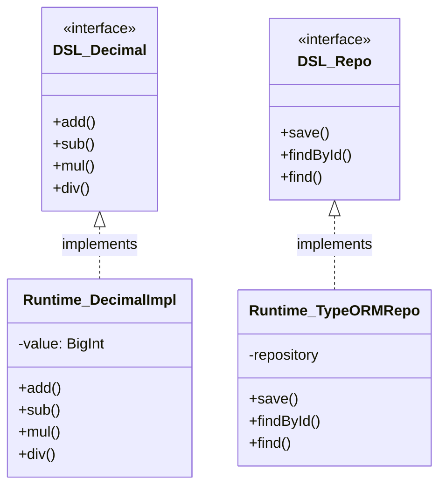

# Data Model Design: @ai-builder/dsl Core Package

## 1. 装饰器元数据模型 (Metadata Model)

虽然 `@ai-builder/dsl` 的装饰器在运行时尽量保持“零逻辑”，但它们产生的元数据是 DSL 编译器的核心输入。以下定义了编译器视角下的元数据结构。

### 1.1 实体元数据 (EntityMetadata)

| 属性 | 类型 | 说明 | 来源 |
|------|------|------|------|
| `className` | string | 实体类名 | 类名 |
| `tableName` | string | 数据库表名 | `@Entity({ table })` |
| `comment` | string | 注释/描述 | `@Entity({ comment })` |
| `isAbstract` | boolean | 是否抽象 | `@Entity({ abstract })` |
| `fields` | `FieldMetadata[]` | 字段列表 | 属性上的 `@Field` |
| `relations` | `RelationMetadata[]` | 关系列表 | 属性上的 `@Composition`/`@Association` |

### 1.2 字段元数据 (FieldMetadata)

| 属性 | 类型 | 说明 | 来源 |
|------|------|------|------|
| `name` | string | 属性名 | 属性名 |
| `label` | string | 显示标签 | `@Field({ label })` |
| `type` | string | 字段类型 | TS 类型反射 / `@Field({ type })` |
| `columnName` | string | 数据库列名 | `@Field({ column })` |
| `nullable` | boolean | 是否可空 | `@Field({ nullable })` |
| `defaultValue` | any | 默认值 | 属性初始化值 |
| `validations` | `ValidationRule[]` | 验证规则 | `@Validation({...})` |

### 1.3 关系元数据 (RelationMetadata)

| 属性 | 类型 | 说明 | 来源 |
|------|------|------|------|
| `name` | string | 属性名 | 属性名 |
| `label` | string | 显示标签 | 装饰器参数 |
| `target` | string | 目标实体类名 | `target: () => Target` |
| `type` | enum | 关系类型 | `OneToOne`, `OneToMany`, `ManyToOne`, `ManyToMany` |
| `isComposition` | boolean | 是否组合 | 使用 `@Composition` 为 true |

## 2. 类型系统模型 (Type System Model)

描述 DSL 类型工具如何映射到运行时结构。

### 2.1 DTO 映射规则

| 类型工具 | 映射逻辑 |
|----------|----------|
| `Command` | 纯数据对象，无方法，用于 API 请求体 |
| `View` | 纯数据对象，无方法，用于 API 响应体 |
| `PageParam` | 包含 `pageNo`, `pageSize` 的查询对象 |
| `PageResult<T>` | 包含 `list: T[]`, `total` 的响应包装 |

## 3. 运行时原语依赖 (Runtime Primitives)

描述 DSL 包中定义的接口与 Runtime 包实现的对应关系。

**设计约束**：
1. DSL 包只定义接口 (`interface`) 和 变量声明 (`declare const`)。
2. Runtime 包负责具体的实现 (`class` 实现 `interface`)。
3. 在应用启动时，通过依赖注入容器将 Runtime 实现绑定到 DSL 接口。

